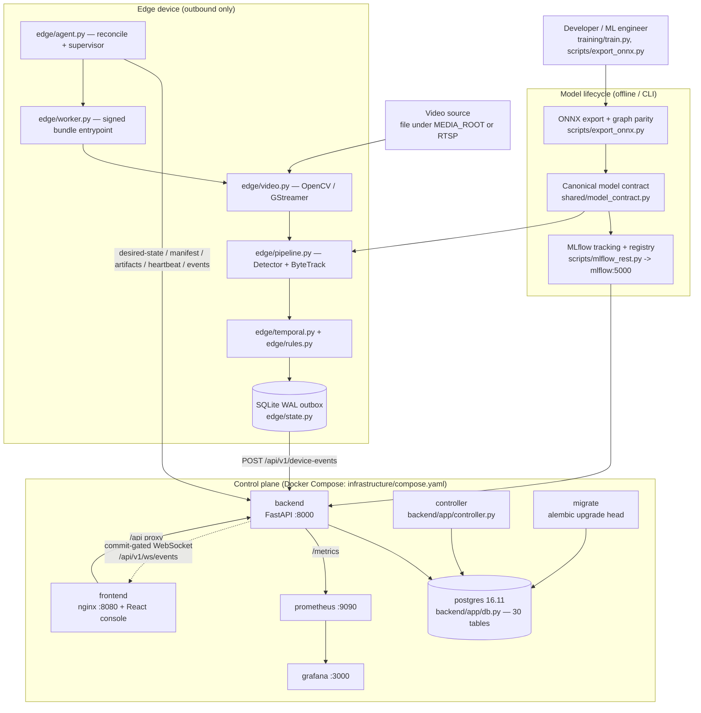
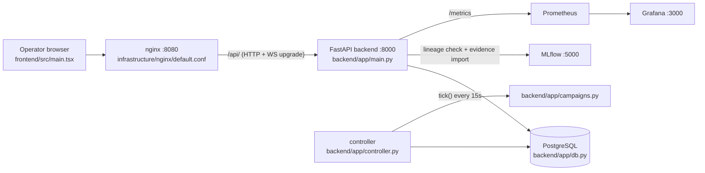
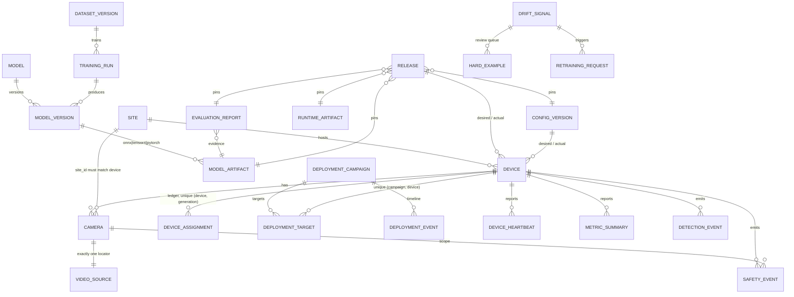
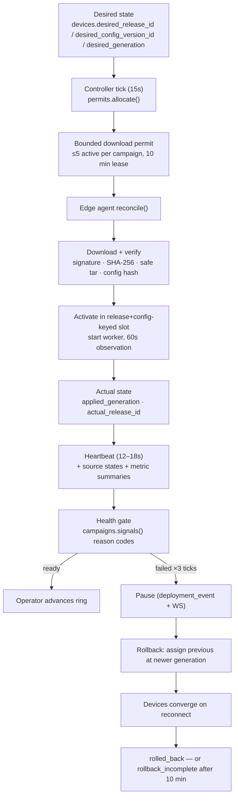
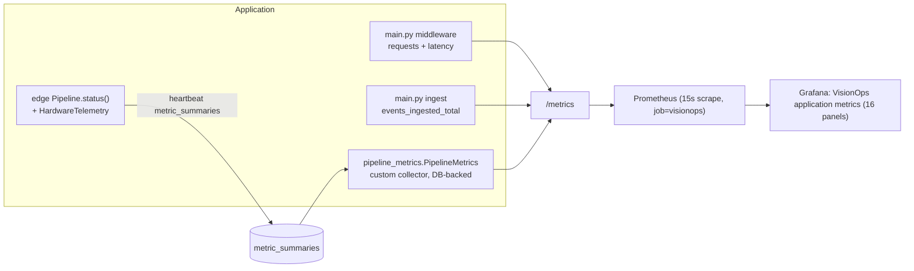
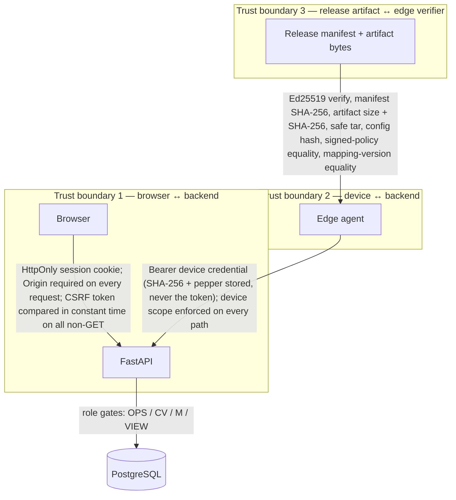

# VisionOps — end-to-end system architecture

**Canonical architecture document for the current repository.** Every module, route,
table, metric and container named here exists in the tree at the path given. Where a
statement is a *runtime* claim, it carries the evidence file that produced it.

Companion documents:

| Document | Purpose |
| --- | --- |
| [VISIONOPS_INTERVIEW_DEMO_FLOW.md](VISIONOPS_INTERVIEW_DEMO_FLOW.md) | The shortest high-impact demo, step by step |
| [VISIONOPS_ARCHITECTURE_AUDIT.md](VISIONOPS_ARCHITECTURE_AUDIT.md) | Findings, severities and recommended fixes |
| [CURRENT_VERIFIED_STATE.md](CURRENT_VERIFIED_STATE.md) | Defect-by-defect verified/unverified status |
| [ARCHITECTURE.md](ARCHITECTURE.md) | The earlier, shorter architecture note (kept for history) |

## How to read the status words

There are exactly four, and they are never inferred from the presence of source code:

| Status | Meaning |
| --- | --- |
| `VERIFIED` | A command in this repository was executed and produced the evidence file cited |
| `IMPLEMENTED_NOT_RUNTIME_VERIFIED` | Source and configuration exist and are statically consistent; it has not been executed here |
| `SIMULATED` | Executed, but the data is explicitly synthetic (logical device, engineering fixture, declared target) |
| `BLOCKED` | Cannot be executed in this environment (hardware, data, or an external dependency that does not exist here) |

**Runtime evidence beats source reading.** Where an older document contradicts an
executed result, the executed result wins — see §16 of the audit.

---

## 18. Summary

### What VisionOps is

A PPE (personal protective equipment) safety-evidence platform for industrial sites,
consisting of a **central control plane** (FastAPI + PostgreSQL + MLflow + Prometheus +
Grafana) and an **outbound edge agent** that runs a real ONNX detector over camera
video, tracks people, applies deterministic temporal safety rules, and delivers
immutable safety events to the control plane through a durable local outbox.

The artifact under test is a real model: Hansung-Cho/yolov8-ppe-detection (YOLOv8n, MIT
licence) exported to `var/model/hansung-p3.onnx`, sha256
`b239aa7e881fc590633944cf37df46ed477f3a819d09ec7a7bdb19d052ca2422`, `[1,3,640,640]`
in, `[1,14,8400]` out (4 box values + **10** source class scores).

### What runs in the cloud / control plane

`frontend` (nginx + React), `backend` (FastAPI), `controller` (campaign reconciler),
`postgres` (PostgreSQL 16.11 — the only central store), `migrate` (Alembic, a separate
one-shot service), `mlflow` (tracking + registry), `prometheus`, `grafana`. Defined only
in `infrastructure/compose.yaml`.

### What runs on the edge

`edge/agent.py` (enrollment, desired-state reconciliation, signed download, activation,
watchdog, heartbeat, delivery) → `edge/worker.py` (signed bundle entrypoint) →
`edge/pipeline.py` (`Detector → ByteTrack → temporal`) → `edge/video.py` (decode) →
`edge/temporal.py` (rules) → `edge/state.py` (SQLite WAL durable outbox). The demo
deployment target is x86_64 CPU with ONNX Runtime; ARM64/Jetson is a typed target that
is `BLOCKED` in this environment.

### How models are deployed

A qualified ONNX artifact is registered through the ordinary model APIs, wrapped in a
signed release manifest, discovered by an agent through `GET /devices/{id}/desired-state`,
downloaded over an authenticated, scoped, SHA-256-checked transfer, **verified against an
Ed25519 signature**, staged into a release+config-keyed slot, started, observed for 60
seconds, and only then committed. Rollback exists on both sides (central and local
watchdog).

### How video becomes a safety event

```
source → decode → bounded latest-frame queue → 5 FPS throttle (drop stale)
      → ONNX Runtime (one canonical contract) → canonical decode + class-aware NMS
      → ByteTrack(person) + head association → deterministic temporal analyzer
      → SafetyEvent payload → SQLite durable outbox → POST /device-events
      → PostgreSQL → commit-gated WebSocket broadcast → console
```

### How MLOps rollout/rollback works

Campaigns carry cumulative 10 % / 25 % / 100 % rings. `POST /deployments/{id}/start`
assigns ring 0 (exactly one canary); `controller.tick()` (PostgreSQL advisory lock) issues
bounded download permits, assesses health gates with machine-readable reason codes,
pauses after three failed ticks, and finalises a rollback only when every assigned device
reports the previous release, the previous config, `healthy`, and a heartbeat fresher than
30 s — otherwise the campaign ends `rollback_incomplete` rather than pretending.

### What is verified

Control plane over PostgreSQL, backend/API over HTTP, the full Hansung release → device →
inference → event → transport chain, real-video inference and tracking, temporal rules,
durable outbox with retry, campaign rollout and central rollback, signature/archive/model
hash rejection, Prometheus + Grafana, and TensorRT on an external Tesla T4.

### What remains hardware-blocked

Physical Jetson, JetPack, Jetson TensorRT, Jetson DeepStream, NVDEC, Jetson
power/thermal, ARM64 execution, and any GPU utilization/VRAM/power/TOPS figure. A T4 is
not a Jetson and the two are never conflated. Model **quality** (mAP, `no_helmet`
precision/recall) is `BLOCKED` on labeled data, not on software.

---

## 1. Executive architecture



Two facts dominate the shape of this system:

1. **The edge is outbound-only.** There is no inbound port to a device, no SSH, no push.
   Deployment is expressed as *desired state at a monotonic generation*; a device that is
   offline for the whole rollout simply converges later. This is why the offline-rollback
   path needs no special code.
2. **One canonical model contract.** `shared/model_contract.py` is imported by the CPU
   adapter (`edge/pipeline.py`), the worker, the offline export gate
   (`scripts/export_onnx.py`) and the DeepStream generator
   (`scripts/gen_deepstream_contract.py`). The 3-class/7-channel vs 10-class/14-channel
   divergence that once existed between the CPU path and the NVIDIA parser is now
   structurally impossible: the parser header, `nvinfer.txt` and the bridge are *generated*
   from the contract.

---

## 2. Control-plane architecture



### 2.1 Service-by-service

| Component | Purpose | Source | Process | Inputs | Outputs | Depends on | Tables | Failure behaviour |
| --- | --- | --- | --- | --- | --- | --- | --- | --- |
| **frontend** | Authenticated operator console | `frontend/src/main.tsx`, `frontend/index.html`, `frontend/vite.config.ts`, `infrastructure/nginx/default.conf` | nginx `:8080` serving a Vite build; proxies `/api/` to `backend:8000` with WebSocket upgrade | Session cookie, user actions | Rendered views, API calls | backend healthy | — (never touches PostgreSQL) | Static assets still serve; API calls surface an error banner with Retry |
| **backend (FastAPI)** | The only writer of central tables; auth, inventory, releases, events, campaigns, drift | `backend/app/main.py`, `lifecycle.py`, `campaigns.py`, `drift.py`, `schemas.py`, `security.py`, `db.py`, `events.py`, `telemetry.py` | `uvicorn backend.app.main:app --host 0.0.0.0 --port 8000` | HTTP from nginx; device bearer tokens | JSON `{data: …}` / `{error: {code, message, details, request_id}}`; Prometheus text | PostgreSQL, MLflow (lineage only) | reads/writes all 30 | `GET /health/live` stays 200 while the DB is down; `GET /health/ready` returns **503 `database_unavailable`** — liveness is never confused with readiness |
| **controller** | Persisted rollout reconciler: issues download permits, evaluates gates, pauses, finalises rollback | `backend/app/controller.py` (7 lines) → `backend/app/campaigns.py::tick()` → `backend/app/permits.py::allocate()` | `python -m backend.app.controller`, loop `tick()` + `sleep(15)` | Campaign/target/device rows | Permit leases, `deployment_events`, campaign status transitions, WebSocket `campaign.status_changed` | PostgreSQL | `deployment_campaigns`, `deployment_targets`, `deployment_events`, `device_assignments`, `devices` | Uses `pg_try_advisory_xact_lock(824712)` so only one controller ticks; a tick exception is caught and logged as `controller_tick_failed`, not fatal |
| **postgres 16.11** | Only central store. No SQLite fallback exists or is permitted | `backend/app/db.py` (`RuntimeError` if `DATABASE_URL` is not `postgresql…`), `infrastructure/postgres-init.sql` | `postgres:16.11-bookworm`, healthcheck `pg_isready` | SQL | Rows | — | 30 tables; `mlflow` database created by init SQL | `pg_isready` failing keeps `migrate`/`backend` from starting |
| **migrate** | One-shot Alembic migration | `backend/alembic.ini`, `backend/alembic/env.py`, `backend/alembic/versions/0001_initial.py` | `alembic -c backend/alembic.ini upgrade head`, then exits | `DATABASE_URL` | Schema at head | postgres healthy | creates all 30 | backend/controller/frontend use `service_completed_successfully`, so a failed migration blocks the whole stack instead of serving a half-schema |
| **mlflow** | Tracking server + model registry + artifact store | `scripts/mlflow_rest.py` (a minimal REST client, because the host venv has no `mlflow` package) | `mlflow server --backend-store-uri postgresql+psycopg://…@postgres:5432/mlflow --artifacts-destination /data/mlflow/artifacts` | REST from backend and scripts | Runs, metrics, artifacts, model versions | postgres healthy | MLflow's own tables in the `mlflow` database (not the 30) | Backend returns `503 registry_unavailable` when MLflow cannot be reached (`lifecycle.py::register_run`, `finish_training`) — it never fabricates lineage |
| **prometheus** | Scrapes the backend | `observability/prometheus/prometheus.yml` | `prom/prometheus:v3.7.3`, 15 s scrape, 7 d retention | `backend:8000/metrics` | Time series | network | — (TSDB in volume) | Target reported `up` historically; a down backend is visible as `up{job="visionops"} == 0` |
| **grafana** | Dashboard + datasource provisioning | `observability/grafana/provisioning/**`, `observability/grafana/dashboards/operations.json` | `grafana/grafana:12.2.1` `:3000` | Prometheus | "VisionOps application metrics" dashboard, uid `visionops`, 16 panels | prometheus | — (own sqlite in volume) | Dashboards are provisioned from files; a missing datasource shows "datasource not found" rather than empty panels |

### 2.2 Request path and identity

```mermaid
sequenceDiagram
    participant B as Browser
    participant N as nginx :8080
    participant A as FastAPI
    participant S as Session (PostgreSQL)
    B->>N: POST /api/v1/auth/login {email, password}
    N->>A: proxy
    A->>A: require Origin == APP_ORIGIN
    A->>S: SELECT users WHERE email AND status='active'
    A->>A: argon2 verify; mint 32-byte session token + CSRF token
    A->>S: INSERT sessions (token_hash, csrf_hash, +8h)
    A-->>B: Set-Cookie visionops_session (HttpOnly, SameSite=Lax) + csrf_token
    B->>N: GET /api/v1/fleet/summary (cookie)
    N->>A: proxy
    A->>S: session join user
    A-->>B: {data: {...}}
    B->>N: POST /api/v1/deployments/{id}/start (cookie + X-CSRF-Token)
    A->>A: mutating method → require Origin + constant-time CSRF compare
    A->>S: campaign transition + deployment_events
    A-->>B: 200 {data: campaign}
```

Two independent credential types never mix: a **browser session cookie** (`security.user()`)
for humans, and a **device bearer token** (`security.device()`) for agents. A device token
cannot call a user endpoint and a session cookie cannot post heartbeats.

### 2.3 Route registration is partly dynamic

`main.py::list_route()` registers 11 list endpoints in a loop, `lifecycle.py::register()`
registers 4 create endpoints, `campaigns.py::register_command()` registers 6 campaign
commands, and `drift.py` registers 3 more list routes. This is why route-count audits must
import the app rather than grep decorators, and why `scripts/audit_release.py` uses
`app.routes`.

---

## 3. Edge data plane

### 3.1 Module ownership

| Concern | Owner | Notes |
| --- | --- | --- |
| Device identity, enrollment, reconciliation, activation, heartbeat, delivery, watchdog | `edge/agent.py` | Single `Agent` class; `--mode real|simulated` |
| Signed bundle entrypoint | `edge/worker.py` | Asserts the released mapping version before loading a candidate; suppresses events until commit |
| Frame ingestion | `edge/video.py` | `VideoSource` contract + `OpenCVSource` + `GStreamerSource`; `VISIONOPS_VIDEO_BACKEND=opencv|gstreamer|auto` |
| Inference runtime abstraction | `edge/runtimes.py` | `ONNX_CPU`, `ONNX_CUDA`, `TENSORRT`; a runtime that is not genuinely available refuses to load |
| Canonical contract, letterbox, decode, NMS | `shared/model_contract.py` | Imported by every path; profiles `hansung_ppe_yolov8n_10`, `subset_3_class`, `external_baseline_yolov8m` |
| Detector + pipeline + tracker | `edge/pipeline.py` | Bounded latest-frame queue (2), 5 FPS throttle, 500 ms freshness |
| Head association + PPE rule | `edge/rules.py` | `no_helmet` must be *positively* observed; `unknown` resets the window |
| Behaviour rules | `edge/temporal.py` | `ppe_sustained`, `zone_dwell`, `low_motion`; deterministic and replayable |
| Durable outbox + activation journal | `edge/state.py` | SQLite WAL, `synchronous=FULL`, bounded by count and bytes |
| Restart/rollback policy | `edge/watchdog.py` | 3 crashes in 5 minutes → local rollback |
| Hardware capability + telemetry | `shared/hardware_profiles.py`, `edge/hardware_telemetry.py` | Absent GPU is `gpu_metrics_available: false`, never 0 % |

### 3.2 The exact sequence, annotated

```mermaid
sequenceDiagram
    autonumber
    participant V as Video source
    participant S as edge/video.py
    participant P as edge/pipeline.py
    participant M as shared/model_contract.py
    participant T as edge/temporal.py + rules.py
    participant O as edge/state.py (SQLite)
    participant A as edge/agent.py
    participant B as backend
    participant DB as PostgreSQL
    participant W as /api/v1/ws/events
    participant U as Console

    V->>S: frames (file or RTSP)
    S->>S: paced decode, bounded latest-frame queue (cap 2), drop-oldest
    S->>P: (session, sequence, decode_monotonic, observed_utc, BGR)
    P->>P: reject if age > 500 ms or < 1/inference_fps since last infer
    P->>M: letterbox → [1,3,640,640] RGB float32
    M->>P: raw tensor [1,14,8400]
    P->>M: decode (score mapped sources {5,0,2}) + class-aware NMS 0.5
    P->>P: ByteTrack(frame_rate=5) on class 0 (person)
    P->>T: TrackObservation(bbox, label from head association)
    T->>T: deterministic rules (sustained / zone dwell / lo-fi motion)
    T-->>P: canonical event dict or None
    P->>O: enqueue(SafetyEvent payload with full provenance)
    A->>O: batch() (≤100 events, ≤1 MB)
    A->>B: POST /api/v1/device-events (Bearer device token)
    B->>B: validate SafetyInput schema, camera scope, assignment provenance, model provenance
    B->>DB: INSERT safety_events (payload_sha256)
    B->>W: publish_on_commit("safety_event.created")
    W->>U: JSON frame after COMMIT
    U->>B: GET /api/v1/safety-events?limit=50
    ...polling remains the source of truth if the socket is down...
```

Provenance carried by every event: `camera_id`, `release_id`, `model_version_id`,
`config_version_id`, `stream_session_id`, `device_id`, `evidence_mode`, `observed_at`,
`window_start`, `window_end`, `supporting_frames`, `confidence`, `bbox`, `payload_sha256`.

**The `evidence_mode` is server-set from `devices.mode`, not client-supplied.** A simulated
device can only ever produce `simulated` rows; this is the structural reason a synthetic
observation can never be presented as a real camera observation.

### 3.3 Sizing and honesty controls inside the pipeline

| Control | Where | Value |
| --- | --- | --- |
| Queue capacity (latest-frame) | `pipeline.DEFAULT_SETTINGS`, signed config | 2 |
| Stale-frame reject | `pipeline` + `video.stale()` | 500 ms |
| Inference throttle | `pipeline.run()` | `inference_fps` = 5 |
| Latency ring buffer | `pipeline.latencies` | last 1024, p50/p95 nearest-rank |
| Outbox caps | `state.enqueue()` | safety: 10 000 rows / 100 MB; detection: 1 000 / 10 MB; 7-day expiry → `lost_events` |
| Archive limits | `security.safe_tar()` and `agent.prepare()` | ≤10 000 members, ≤2 GiB, no absolute/`..`/backslash, files+dirs only |
| Activation observation | `agent.reconcile()` | 60 s, checked every 5 s |
| Heartbeat cadence | `agent.run()` | every 12–18 s randomised, plus delivery every second |

---

## 4. Model lifecycle

```mermaid
flowchart LR
    ds["Dataset<br/>training/validate_dataset.py"] --> train["Train<br/>training/train.py (YOLO11n + MLflow)"]
    train --> ckpt["Checkpoint<br/>var/tools/hansung-best.pt"]
    ckpt --> exp["Export + parity gate<br/>scripts/export_onnx.py"]
    exp --> onnx["ONNX artifact<br/>var/model/hansung-p3.onnx"]
    onnx --> contract["Canonical contract<br/>shared/model_contract.py"]
    contract --> gen["Generated NVIDIA contract<br/>scripts/gen_deepstream_contract.py"]
    onnx --> qual["Qualification<br/>scripts/verify_model_contract.py"]
    onnx --> mlf["MLflow run + registry<br/>scripts/release_hansung.py"]
    mlf --> rel["Release manifest + signature<br/>backend/app/lifecycle.py"]
    rel --> camp["Campaign + rings<br/>backend/app/campaigns.py"]
    camp --> des["Desired state generation<br/>GET /devices/{id}/desired-state"]
    des --> dl["Scoped, hash-checked download<br/>edge/agent.py::artifact()"]
    dl --> stage["Slot + archive validation<br/>agent.prepare()"]
    stage --> act["Activate + 60s observe<br/>agent.reconcile()"]
    act --> health["Heartbeat health + gates<br/>campaigns.signals()"]
    health --> rb["Rollback (central or local watchdog)"]
```



| Stage | Code | Artifact | Version identifier | Gate |
| --- | --- | --- | --- | --- |
| Dataset validation | `training/validate_dataset.py` | `training/data/validation.json` (a **declared DVC output in `training/dvc.yaml`; never produced here** — no dataset exists in the tree) | `split_manifest_sha256` | licence + taxonomy + YOLO geometry + no group leakage + path-traversal check |
| Training | `training/train.py` | MLflow run + ONNX | `mlflow_run_id` | taxonomy must equal `[person, helmet, no_helmet]`; base weights supplied locally, never a COCO substitute |
| Export | `scripts/export_onnx.py` | ONNX | opset 17, IR 8 | **Two-threshold graph parity** through the *same* canonical decoder: every PyTorch detection must be matched by an ONNX detection of the same canonical class at IoU ≥ 0.5 and |Δconf| ≤ 0.05, at threshold 0.35 **and** 0.001. Export succeeding is never qualification |
| Contract | `shared/model_contract.py` | `var/model/hansung-p3.json`, generated header/nvinfer | `class_mapping_version` = `hansung_ppe_yolov8n_10@0be69c90227d20ba` | model's own `names` metadata must satisfy the mapping (auto-detected profile) |
| Registration | `scripts/release_hansung.py` → `POST /models`,`/model-versions`,`/model-artifacts` | DB rows | `model_version_id`, `artifact_sha256` | uploaded bytes re-hashed server-side; contract↔artifact hash must agree |
| Evaluation | `POST /evaluation-reports` → `lifecycle.evaluation()` | `evaluation_reports` | `evidence_report_id` | `evidence_mode=real` recomputes metrics from raw MLflow evidence via `training/quality.measured()` then `gate()`; summary claims cannot lower the gate. `simulated` requires `evidence_ref` `mlflow:…` + `run_kind=simulation_fixture` |
| Release | `POST /releases` | immutable manifest | `manifest_sha256` | all four artifacts must share one hardware profile; evaluation must reference the same model artifact. `release_identity()` additionally records architecture, runtime + version, model format/precision, input shape, `class_mapping_version`, `model_head_channels`, dataset identity and the source MLflow run — see the evidence skew noted below |
| Approval | `POST /releases/{id}/approve` | signature | `key_id` | Ed25519 over `canonical(manifest)`; evaluation must be `passed` |
| Deployment | `POST /deployments`, `/start`, `/advance` | campaign rows | `desired_generation` | eligibility (profile, enrolled, fresh, healthy, converged, ≥300 s and ≥100 samples of baseline) |
| Activation | `agent.reconcile()` | slot | `applied_generation` | signature, manifest hash, config hash, artifact size+SHA, safe tar, 60 s observation |
| Health | `campaigns.signals()` | reason codes | — | unknown telemetry never passes a gate |

**How a model actually gets to an edge device today:** the qualified artifact is registered
by `scripts/release_hansung.py` with a **simulation-labelled evaluation record**, because
no labeled PPE/temporal benchmark exists here and the server-owned real gate must not be
bypassed. The release therefore carries `evidence_mode=simulated` and can only be
reconciled by a `mode=simulated` device. That is the honest boundary: the *artifact* is
real and hash-identical end to end, the *promotion evidence* is not.

> **Evidence skew you must state, not smooth over.** `backend/app/lifecycle.py::release_identity()`
does record the mapping version and bundle identity in every new manifest — that is a
property of the *current code*. The **retained** release evidence predates it: the manifest
in `var/hansung-release.json` has exactly 16 keys (`schema_version`, `release_id`,
`hardware_profile`, `evidence_mode`, `model_artifact_id`, `model_sha256`, `model_size_bytes`,
`runtime_artifact_id`, `runtime_sha256`, `runtime_size_bytes`, `config_version_id`,
`config_sha256`, `evaluation_report_id`, `compatibility`, `entrypoint`) and carries **no**
`class_mapping_version`/`architecture`/`runtime`/`input_shape` fields. So the identity block
is **code-verified, evidence-stale**: to show it, create a fresh release with the current
image. Audit finding P1-7.

---

## 5. Release and deployment architecture

### 5.1 Entities (all from `backend/app/db.py`)



Concepts that exist in code: **Site, Device, Camera, VideoSource, Model, ModelVersion,
ModelArtifact, RuntimeArtifact, DatasetVersion, TrainingRun, EvaluationReport, ConfigVersion,
Release, Assignment (desired-state ledger), DeploymentCampaign, DeploymentTarget,
DeploymentEvent, Heartbeat, MetricSummary, SafetyEvent, DetectionEvent, EnrollmentToken,
Boot, DriftSignal, HardExample, RetrainingRequest, AuditEvent, IdempotencyRecord, Session,
User.** There is no separate "Ring" table — a ring is `deployment_targets.ring ∈ {0,1,2}`.
"Desired state" and "actual state" are column pairs on `devices`, not tables.

### 5.2 The control loop



Key properties, all enforced in `backend/app/campaigns.py`:

* **Unknown never passes.** `HEARTBEAT_STALE`, `NO_TELEMETRY` and `health_unknown` block
  advancement. Absent GPU data gates nothing and is recorded as
  `gpu_metrics_available: false`.
* **Assignments are append-only.** `device_assignments` is unique on
  `(device_id, generation)`; nothing is mutated in place, so the ledger is an audit trail.
* **Stale reports cannot overwrite newer state.** Heartbeats only update device columns when
  `applied_generation >= devices.applied_generation`.
* **Replay is safe.** Mutating requests require an `Idempotency-Key` UUID; a repeat with the
  same body returns the stored response, a repeat with a different body returns
  `idempotency_conflict`, and a `pg_advisory_xact_lock` serialises identical concurrent keys.

---

## 6. Canary and rollback flow

```mermaid
sequenceDiagram
    autonumber
    participant Op as Operator (console/API)
    participant API as backend/campaigns.py
    participant DB as PostgreSQL
    participant Ctl as controller.tick()
    participant Ag as Edge agents (10)
    Op->>API: POST /releases (v2 = same qualified bytes, new label)
    API->>DB: INSERT releases (approved + signed)
    Op->>API: POST /deployments {release_id, 10 device ids, reason}
    API->>DB: INSERT campaign + targets; ring = 0 for ceil(10%) = 1 device
    API-->>Op: eligibility[] per device
    Op->>API: POST /deployments/{id}/start {expected_status: draft}
    API->>API: eligible() for every target, else refuse
    API->>DB: previous_release_id = actual; assign ring 0 only
    loop every 15s
        Ctl->>DB: allocate permits (≤5)
        Ag->>API: GET /desired-state → permit for the canary
        Ag->>API: GET /releases/{v2}/manifest (signed)
        Ag->>API: GET /model-artifacts/{id}/content (scoped)
        Ag->>Ag: verify signature + size + SHA-256 + safe tar
        Ag->>Ag: activate, observe 60s, commit actual state
        Ag->>API: POST /heartbeats (applied_generation, health)
    end
    Op->>API: POST /deployments/{id}/advance {expected_ring: 0}
    API->>API: assess() must be 'ready' or gates_not_ready
    Note over Op,Ag: FAILURE INJECTION (scripts/simulate_fault --fault offline)
    Ag->>Ag: stop heartbeating (fault-offline marker)
    Ctl->>DB: 3 consecutive failed ticks → status = paused
    Op->>API: POST /deployments/{id}/rollback {reason}
    API->>DB: assign previous release/config at a NEWER generation
    Ctl->>DB: targets become rollback_pending → rolled_back
    Ag->>API: reconnect after fault recovered → reconcile to v1
    Ctl->>DB: all 10 converged + healthy + fresh → status = rolled_back
```

### Real logic vs simulation vs unverified

| Element | Classification | Evidence |
| --- | --- | --- |
| Ring sizing `[10 %, 25 %, 100 %]`, exactly one ring-0 canary for 10 targets | **REAL IMPLEMENTED LOGIC** | `campaigns.create_campaign()`; `var/hansung-canary-campaign.json` shows ring-0 canary assigned generation 4 with all 10 devices eligible |
| Eligibility gate (profile, enrolled, fresh ≤30 s, healthy, converged, ≥300 s + ≥100 samples baseline) | **REAL IMPLEMENTED LOGIC** | `campaigns.eligible()` / `aggregate()`; the canary script probes the *running application's* gate via `docker compose exec backend` rather than reimplementing it |
| Failure pause after 3 consecutive failed ticks | **REAL IMPLEMENTED LOGIC** | `tick()`: `c.failure_windows >= 3 → status='paused'` + `deployment_events`; **runtime-observed** as `status_before: "paused"` in `var/hansung-canary-cleanup.json`, though the cause code for that specific pause is not captured in the retained evidence |
| Central rollback to previous release/config at a newer generation | **REAL, RUNTIME VERIFIED** | `var/hansung-canary-cleanup.json`: `paused → rolled_back`, 10/10 devices `v1`, converged, `healthy` |
| Recovery: devices converge without a new assignment | **REAL, RUNTIME VERIFIED** | same file (`converged: true` for all 10) |
| Bounded download leases (≤5, transfer on convergence, reclaim when stale) | **REAL IMPLEMENTED LOGIC**, component-verified | `backend/app/permits.py`; `docs/evidence/continuation-runtime.json` |
| 10 devices = simulated inventory (`mode=simulated`), 3 real agent processes | **SIMULATION** | `var/hansung-canary-fleet.json`, `var/simulation/canary/*/state.sqlite`; the agents are real code with real SQLite and real HTTP, but the worker observations are `simulated_worker` |
| Full phase-A/phase-B evidence files | **MISSING** | `scripts/hansung_canary.py` writes `var/hansung-canary-phaseA.json` / `phaseB.json`; neither exists, so the complete pause **cause** chain is not retained (audit finding P1) |
| 100 % ring, sustained multi-hour soak | **NOT RUN** | no evidence file exists |
| Canary on physical devices | **BLOCKED** | no physical device exists here |

The single most important nuance: `assess()` **never** declares success from a timeout. A
rollback that has not converged ends `rollback_incomplete`; a ring window that has no
telemetry stays `waiting` with `NO_TELEMETRY`. Both are visible in the console as gate
reason codes with descriptions.

---

## 7. Observability architecture



### 7.1 Metric names that exist in code

| Metric | Type | Labels | Source |
| --- | --- | --- | --- |
| `visionops_http_requests_total` | Counter | method, route, status | `main.py` middleware |
| `visionops_http_duration_seconds` (`_bucket`) | Histogram | route | `main.py` middleware |
| `visionops_events_ingested_total` | Counter | mode, kind | `main.py::ingest()` |
| `visionops_database_observations_available` | Gauge | — | `pipeline_metrics.py` (0 when the DB query fails) |
| `visionops_camera_observation_age_seconds` | Gauge | device_id, camera_id, mode | `pipeline_metrics.py` |
| `visionops_camera_inference_latency_ms` | Gauge | …+ quantile (0.5, 0.95) | `pipeline_metrics.py` |
| `visionops_camera_<field>` | Gauge | device_id, camera_id, mode | `pipeline_metrics.py` for `input_fps`, `inference_fps`, `processed_fps`, `decode_fps`, `queue_depth`, `outbox_depth`, `dropped_frames`, `reconnect_count`, `rtsp_connected`, `stream_age_seconds`, `inference_latency_ms_p95`, `rss_bytes`, `cpu_percent`, `gpu_utilization_ratio` |
| `visionops_device_health` | Gauge | device_id, mode, health | `pipeline_metrics.py` (forced `unknown` when older than 60 s) |
| `visionops_device_heartbeat_age_seconds` | Gauge | device_id, mode | `pipeline_metrics.py` |
| `visionops_device_version_info` | Gauge | device_id, application_version, model_version, artifact_version | `pipeline_metrics.py` |
| `visionops_campaign_status` | Gauge | campaign_id, mode, status | `pipeline_metrics.py` |

**Deliberate omissions.** `pipeline_metrics.py` only emits a field when the device actually
reported it (`isinstance(value, (int,float)) and math.isfinite(value)`), and skips windows
older than 30 s. A missing series means *unknown*. `gpu_utilization_ratio` therefore never
appears on this host. `visionops_camera_outbox_depth` is only produced by real-mode worker
heartbeats, so it is empty while the device under test is `simulated`.

### 7.2 Grafana

`observability/grafana/provisioning/datasources/main.yaml` provisions Prometheus
(`http://prometheus:9090`, default). `observability/grafana/provisioning/dashboards/main.yaml`
loads every JSON under `/var/lib/grafana/dashboards`. `observability/grafana/dashboards/operations.json` is
"VisionOps application metrics" (uid `visionops`, 15 s refresh) with 16 panels: API request
rate, API p95 latency, persisted events by mode, backend availability (`up`),
camera input/inference FPS, camera p95 ms, dropped frames, reconnects, decoder queue,
device heartbeat age, campaign state, decode-vs-processed FPS, stream connectivity, stream
age, reported observation p95.

### 7.3 What an interviewer can actually observe

| During… | Observable |
| --- | --- |
| Normal inference | `visionops_camera_*` series (in a **real**-mode deployment); edge-side `Pipeline.status()` counters; annotated evidence frames |
| Device heartbeat | `visionops_device_heartbeat_age_seconds`, `visionops_device_health`, `visionops_device_version_info` (`application_version=ppe-hansung-v1`) |
| A deployment | `visionops_campaign_status{campaign_id,status}`, `deployment_events`, gate reason codes with human descriptions |
| An unhealthy device | `visionops_device_health{health="unhealthy"}` + heartbeat age climbing past 60 s → the panel flips to `unknown` |
| A rollback | campaign status `rolling_back → rolled_back`, `deployment_events` timeline, devices returning to `v1` |

---

## 8. Data architecture

| Data | Owner (writer) | Storage | Persistence | Source code | Consumers |
| --- | --- | --- | --- | --- | --- |
| Users, sessions | backend (`auth/*`) | PostgreSQL | durable | `backend/app/db.py`, `main.py`, `security.py` | login, role checks |
| Sites, devices, cameras, video sources | backend (`POST/PATCH` inventory routes) | PostgreSQL | durable | `main.py`, `db.py` | console, campaigns, agent reconciliation |
| Desired/actual device state | backend (device traffic + controller) | PostgreSQL `devices` + `device_assignments` | durable, append-only ledger | `main.py::heartbeat`, `campaigns.py` | agent, gates, console |
| Models, versions, artifacts, datasets, training runs | backend (CV roles) | PostgreSQL rows + artifact **bytes on a Docker volume** (`DATA_DIR/artifacts/<sha256>`) | durable | `lifecycle.py`, `db.py` | release creation, agent download |
| Releases + manifests + signatures | backend (`lifecycle.py`) | PostgreSQL (manifest JSONB, Ed25519 signature, `manifest_sha256`) | immutable once approved | `lifecycle.py`, `security.py` | agent verification, console |
| Campaigns, targets, deployment events | backend + controller | PostgreSQL | durable | `campaigns.py`, `db.py` | console, gates, audit |
| Safety/detection events | backend (accepted from devices) | PostgreSQL with `payload_sha256` for idempotency | durable | `main.py::ingest`, `db.py` | console, WebSocket, metrics |
| Safety-event snapshots (JPEG) | backend | filesystem `DATA_DIR/evidence/<sha256>.jpg` | 7-day read window (`410 expired` after) | `main.py::upload_snapshot` | console evidence viewer |
| Heartbeats, metric summaries | backend | PostgreSQL | durable | `main.py::heartbeat` | gates, Prometheus collector |
| Drift signals, hard examples, retraining requests | backend (CV roles) | PostgreSQL (+ JPEG on disk) | durable | `drift.py` | review UI, retraining lineage |
| Audit events | backend | PostgreSQL | durable | `main.py::audit` | audit trail |
| Idempotency records | backend | PostgreSQL, 24 h expiry | durable but expires | `main.py::replay` | request replay safety |
| Edge outbox (undelivered events) | edge agent | **SQLite WAL** `<state>/state.sqlite`, `synchronous=FULL` | survives process restart; bounded (count + bytes), 7-day expiry | `edge/state.py` | `agent.deliver()` |
| Edge activation/identity/watchdog journal | edge agent | **SQLite** key/value `kv` table | survives restart | `edge/state.py`, `agent.py` | `reconcile()`, `supervise()` |
| Edge artifact cache | edge agent | filesystem `<state>/artifact-cache/<sha256>` + `slots/` | content-addressed, reusable | `agent.py::artifact()` | activation |
| MLflow runs/models/artifacts | MLflow | **separate `mlflow` PostgreSQL database** + `mlflow` Docker volume | durable | `scripts/mlflow_rest.py`, `train.py`, `recompute_evidence.py` | backend lineage checks |
| Prometheus time series | Prometheus | TSDB in a Docker volume, 7-day retention | durable, bounded | `observability/prometheus/prometheus.yml` | Grafana |
| Grafana state | Grafana | its own sqlite in a Docker volume; dashboards from files | durable | `observability/grafana/**` | humans |
| Compose stack as a whole | Docker | named volumes `postgres`, `artifacts`, `mlflow`, `prometheus`, `grafana` | durable | `infrastructure/compose.yaml` | everything |

**Boundaries that matter:** PostgreSQL is the *only* central store (`db.py` raises if
`DATABASE_URL` is not PostgreSQL). SQLite appears **only** on the edge, for the outbox,
identity and activation journal — never as a central fallback. MLflow uses its own database
even though both live in the same PostgreSQL server.

---

## 9. API architecture

All routes are prefixed `/api/v1` except the three unauthenticated operational endpoints.
Responses are uniformly `{"data": …}` or
`{"error": {code, message, details, request_id}}`. Auth column: **cookie** = session cookie
(+ `X-CSRF-Token` and matching `Origin` on every non-GET), **device** = `Authorization:
Bearer <device_credential>`, **public** = none.

### Authentication and sessions — `backend/app/main.py`

| Method | Path | Purpose | Auth | Main input | Main output |
| --- | --- | --- | --- | --- | --- |
| POST | `/api/v1/auth/login` | Create a session | public + Origin | `{email, password}` | user + `csrf_token`; sets HttpOnly cookie |
| GET | `/api/v1/auth/me` | Current user, rotate CSRF | cookie | — | user + fresh `csrf_token` |
| POST | `/api/v1/auth/logout` | Delete the session | cookie + CSRF | `{}` | `{logged_out: true}` |

### Health, metrics, contracts

| Method | Path | Purpose | Auth | Output | Source |
| --- | --- | --- | --- | --- | --- |
| GET | `/health/live` | Process liveness (no DB) | public | `{status: alive}` | `main.py` |
| GET | `/health/ready` | DB readiness | public | `{status: ready}` or 503 `database_unavailable` | `main.py` |
| GET | `/metrics` | Prometheus exposition | public (nginx returns 404 for it, so it is container-internal) | text | `main.py` + `pipeline_metrics.py` |
| GET | `/openapi.json` | Schema | public | OpenAPI | FastAPI |

### Fleet and inventory

| Method | Path | Purpose | Auth | Input | Output |
| --- | --- | --- | --- | --- | --- |
| GET | `/api/v1/sites` | List sites | cookie | `limit`, `cursor`, `status` | keyset page |
| POST | `/api/v1/sites` | Create site | cookie (OPS) | `{name, timezone}` | site |
| GET | `/api/v1/sites/{site_id}` | Site detail | cookie | — | site |
| PATCH | `/api/v1/sites/{site_id}` | Rename/archive | cookie (OPS) | `{name?, status?}` | site; refuses archiving with active devices |
| GET | `/api/v1/devices` | List devices | cookie | `site_id`, `mode`, `health_status` | keyset page |
| POST | `/api/v1/devices` | Register device | cookie (OPS) | `{site_id, name, mode, hardware_profile, release_id}` | device + gen-1 assignment |
| GET | `/api/v1/devices/{device_id}` | Detail incl. desired state, profile, reported runtime | cookie | — | `{device, last_heartbeat, desired_state, hardware_profile, reported_runtime}` |
| PATCH | `/api/v1/devices/{device_id}` | Rename / revoke | cookie (OPS) | `{name?, registration_status?}` | device (`revoked` clears the credential) |
| GET | `/api/v1/fleet/summary` | Console cards | cookie | `mode`, `site_id` | counts, online/offline, mismatch |
| GET | `/api/v1/hardware-profiles` | Declared profile matrix | cookie | — | `{profiles, compatibility_evaluated_at}` |
| GET | `/api/v1/cameras` / POST | Camera inventory | cookie / OPS | `{site_id, device_id, name}` | camera (max 4 per device) |
| PATCH | `/api/v1/cameras/{camera_id}` | Enable/disable | cookie (OPS) | `{name?, status?}` | camera; refuses while a campaign is active |
| GET | `/api/v1/video-sources` / POST | Locator binding | cookie / OPS | `{camera_id, kind: file|rtsp, locator, enabled, loop}` | source + new config version (one source per camera) |
| PATCH | `/api/v1/video-sources/{source_id}` | Toggle/relocate (optimistic revision) | cookie (OPS) | `{expected_source_revision, …}` | source + config version |

### Device traffic (device bearer token)

| Method | Path | Purpose | Input | Output |
| --- | --- | --- | --- | --- |
| POST | `/api/v1/devices/{id}/enrollment-tokens` | Issue a 10-minute single-use token | `{reason}` (OPS user, not device) | `{token, expires_at}` |
| POST | `/api/v1/device-enrollments` | Exchange token for a device credential | `{token, capabilities}` | `{device_id, site_id, device_credential}` |
| GET | `/api/v1/devices/{id}/desired-state` | The control-plane → device contract | — | `{generation, release_id, config_version_id, manifest_sha256, config_sha256, download_permit, issued_at}` + `ETag`/304 |
| POST | `/api/v1/devices/{id}/heartbeats` | State, health, source states, metrics | `HeartbeatInput` | `{accepted, server_time, desired_generation}` |
| POST | `/api/v1/device-events` | Batch ingest (≤100) of safety/detection events | `{events: [...]}` | per-event `{status: accepted|duplicate|rejected}` |
| POST | `/api/v1/devices/{id}/commission` | Re-attempt a failed first activation | `{release_id, expected_generation, reason}` | device |

### Releases, artifacts, configuration and lineage

| Method | Path | Purpose | Auth | Notes |
| --- | --- | --- | --- | --- |
| GET | `/api/v1/releases` | List releases | cookie | filter `status`, `hardware_profile` |
| GET | `/api/v1/releases/{id}/manifest` | Signed manifest | cookie **or** device (scoped) | refuses unless `approved` |
| POST | `/api/v1/releases` | Create draft release | cookie (CV) | builds the immutable manifest |
| POST | `/api/v1/releases/{id}/approve` | Sign + approve | cookie (M = mlops_engineer) | Ed25519 verify; evaluation must be `passed` |
| POST | `/api/v1/releases/{id}/revoke` | Revoke | cookie (M) | refused while referenced by a device |
| GET | `/api/v1/config-versions/{id}` | Signed settings | cookie or device-scoped | — |
| POST | `/api/v1/config-versions` | Create config | cookie (CV) | settings must equal `shared/contracts/default-settings.json` byte-for-byte |
| GET | `/api/v1/{model-artifacts|runtime-artifacts}/{id}/content` | Artifact bytes | cookie or device-scoped | `ETag` = sha256 |
| POST | `/api/v1/model-artifacts` | Upload ONNX/TRT/pytorch + metadata | cookie (CV) | hash computed server-side, ONNX load-probed; class_map must match the default taxonomy |
| POST | `/api/v1/runtime-artifacts` | Upload the worker tar | cookie (M) | `safe_tar()` validated; entrypoint must be `worker` |
| POST | `/api/v1/models` | Register a model | cookie (CV) | `task` must be `ppe_detection` |
| GET | `/api/v1/models/{id}` | Detail with versions/datasets/runs/evaluations/releases | cookie | — |
| POST | `/api/v1/model-versions` | Version a model | cookie (CV) | training run must be `succeeded` |
| POST | `/api/v1/dataset-versions` | Dataset lineage | cookie (CV) | validated requires evidence ref |
| POST | `/api/v1/training-runs` | Register a run | cookie (CV) | **queries MLflow live**; mismatch → 422 |
| PATCH | `/api/v1/training-runs/{id}` | Finish a run | cookie (CV) | refuses unless MLflow says `FINISHED`/`FAILED` |
| POST | `/api/v1/evaluation-reports` | Evidence + gate | cookie (CV) | `real` recomputes from raw evidence; `simulated` requires an MLflow ref |

### Events, campaigns, drift

| Method | Path | Purpose | Auth |
| --- | --- | --- | --- |
| GET | `/api/v1/safety-events` | List (filter camera_id, review_status, evidence_mode) | cookie |
| GET | `/api/v1/safety-events/{id}` | Detail | cookie |
| PATCH | `/api/v1/safety-events/{id}` | Acknowledge | cookie (VIEW) |
| POST | `/api/v1/safety-events/{id}/snapshot` | Upload ≤512 KB JPEG (device-scoped) | device |
| GET | `/api/v1/safety-events/{id}/snapshot` | Evidence image | cookie |
| GET | `/api/v1/detections` | Detection event list | cookie |
| GET | `/api/v1/metrics/summaries` | Persisted windows | cookie |
| GET | `/api/v1/deployments` | Campaign list | cookie |
| POST | `/api/v1/deployments` | Create campaign (≥10 distinct targets) | cookie (M) |
| GET | `/api/v1/deployments/{id}` | Detail + `gate_status`, `gate_reasons`, `target_signals`, `reason_code_descriptions` | cookie |
| GET | `/api/v1/deployments/{id}/targets` | Targets | cookie |
| GET | `/api/v1/deployments/{id}/events` | Timeline | cookie |
| POST | `/api/v1/deployments/{id}/{start\|advance\|pause\|resume\|rollback\|cancel}` | Transitions incl. `expected_status` / `expected_ring` guards | cookie (M) |
| GET/POST | `/api/v1/drift-signals`, `/hard-examples`, `/retraining-requests` | Drift screen + hard-example review + retraining lineage | cookie (CV) |
| PATCH | `/api/v1/drift-signals/{id}`, `/hard-examples/{id}`, `/retraining-requests/{id}` | Review transitions | cookie (CV) |
| WS | `/api/v1/ws/events` | Realtime stream | cookie + Origin on handshake |

---

## 10. Security architecture



| Control | Implementation | Evidence |
| --- | --- | --- |
| Authentication (human) | Argon2id password hash; 256-bit session token; 8 h expiry; `HttpOnly`, `SameSite=Lax`, `Secure` when the origin is HTTPS | `backend/app/security.py`, `main.py` |
| Server-side secrets | `TOKEN_PEPPER` (≥32 chars enforced at import), session/CSRF tokens stored only as peppered SHA-256 | `security.py` |
| Authorization | Role sets `OPS{fleet_operator, mlops_engineer}`, `CV{cv_engineer, mlops_engineer}`, `M{mlops_engineer}`, `VIEW{safety_viewer, fleet_operator, mlops_engineer}` | `security.py` |
| CSRF | `Origin == APP_ORIGIN` **and** constant-time CSRF compare on every non-GET/HEAD | `security.user()` |
| Device identity | Enrollment token (10 min, single use, previous tokens consumed) → opaque credential; revoked devices are refused | `main.py::enroll`, `device()` |
| Release signing | Ed25519 over `canonical(manifest)`; key id charset validated; only the `.pub` file is trusted | `security.verify_signature()` |
| Integrity | SHA-256 for artifacts, manifests, configs and event payloads; artifact `ETag` | `lifecycle.py`, `agent.py`, `db.py` |
| Archive safety | ≤10 000 members, ≤2 GiB, no absolute paths, no `..`, no backslashes, files/dirs only (symlinks and specials rejected), `filter='data'` on extract | `security.safe_tar()`, `agent.prepare()` |
| Path traversal | `validate_locator()` confines file locators to `MEDIA_ROOT.resolve()` via `is_relative_to`; RTSP locators reject embedded credentials | `main.py` |
| Provenance enforcement | An event is rejected unless the device holds an assignment for that release+config **and** the release's artifact matches the event's `model_version_id`; cameras must belong to the device | `main.py::ingest` |
| Secret hygiene | `db.public()` drops `password_hash`, `token_hash`, `csrf_hash`, `credential_hash`, `storage_key`, `evidence_key`, `payload_sha256` from every response | `backend/app/db.py` |
| Transport policy | The agent refuses a non-HTTPS URL unless the host is localhost or `ALLOW_PRIVATE_HTTP=1` | `edge/agent.py` |
| Secret scanning | `scripts/make_jetson_bundle.py`, `scripts/package_release.py` refuse to ship a bundle containing private keys or development paths | both scripts |

**No LLM/AI component exists in this architecture.** There is no model-inference endpoint,
no prompt handling and no third-party AI service anywhere in the tree. The only "AI" is the
offline-trained ONNX object detector.

**Deliberate non-claims:** there is no TLS termination in the Compose stack (the console is
loopback HTTP by design), no rate limiting, no WAF, and image tags are not digest-pinned.

---

## 11. Failure architecture

| Failure | Handled? | Retried? | Persisted? | Surfaced? | Where |
| --- | --- | --- | --- | --- | --- |
| Backend unavailable | yes | yes | yes | yes | `agent.run()` catches `httpx.HTTPError` → `self.error`; heartbeat `last_error_code` |
| PostgreSQL unavailable | yes (fail closed) | n/a | writes fail | yes | `/health/ready` → 503; `pipeline_metrics` emits `observations_available 0` |
| MLflow unavailable | yes | no | no | yes | `registry_unavailable` 503 from `lifecycle.py` (lineage is never fabricated) |
| Network loss / agent offline | yes | yes | yes | yes | Outbox retains events (`var/hansung-transport.json`: depth 1 while unreachable → 0 after restore) |
| Device offline | yes | on reconnect | yes | yes | Campaign target stays `pending`; fleet summary counts `offline`/`never_seen` |
| Bad artifact hash | yes | no | yes (`rejected_generation`) | yes | `agent.artifact()` → `artifact_hash`; `agent.prepare()` → `model_hash_mismatch` |
| Bad signature | yes | no | yes | yes | `prepare()` raises before any download; backend `signature_invalid` 422 |
| Release download failure | yes | yes via reconcile | yes | yes | `self.error` + `phase='rolling_back'` |
| Model load failure | yes | no | yes | yes | Worker raises; agent rolls back; gate reason `MODEL_LOAD_FAILURE` |
| Camera / video failure | yes (deliberately *not* a crash) | yes | yes | yes | `worker_health()` distinguishes process liveness from source health; `process_alive()` treats EOF as source condition |
| Video backend unavailable | yes | no (fails fast) | — | yes | `VideoBackendUnavailable('gstreamer_bindings_unavailable')` |
| Event submission failure | yes | yes | yes | yes | Outbox + `deadletter` for `rejected`, retried on the next tick |
| Duplicate event | yes | n/a | yes | yes | `payload_sha256` compare → `duplicate`; verified twice |
| Duplicate/parallel request | yes | n/a | yes | yes | `Idempotency-Key` + advisory lock |
| Controller restart | yes | n/a | yes | yes | State lives only in PostgreSQL; `tick()` re-derives everything (canary script restarts the controller to prove it) |
| Edge restart mid-activation | yes | n/a | yes | yes | `Agent.__init__` restores `actual = journal.previous` and records the candidate as rejected — a half-activated candidate is never committed |
| Committed worker crash loop | yes | bounded backoff | yes | yes | `watchdog.py`: 3 crashes/5 min → local rollback; verified with real subprocesses |
| Deployment unhealthy | yes | 3 ticks then pause | yes | yes | `failure_windows >= 3` → `paused` + reason codes |
| Rollback that never converges | yes (fails honest) | until 10 min | yes | yes | `rollback_incomplete` |
| Expired evidence / retention | **NOT IMPLEMENTED** | n/a | n/a | partial | Snapshots expire on read after 7 days (`410`), but there is no cleanup job |
| Rate limiting | **NOT IMPLEMENTED** | — | — | — | — |

---

## 12. Real vs simulated vs blocked

| Capability | Status | Evidence | Boundary |
| --- | --- | --- | --- |
| FastAPI backend | `VERIFIED` | `docs/evidence/service-runtime.json` (liveness 200, 59 OpenAPI paths); Docker stack live | native venv lacks fastapi → control plane runs **only** in Docker here |
| PostgreSQL central store | `VERIFIED` | `docs/evidence/HANSUNG_PPE_E2E_VERIFICATION.md` (release→device→event→API over PostgreSQL) | — |
| Alembic migrations | `VERIFIED` | `migrate` service gated on `service_completed_successfully` | — |
| Frontend console | `VERIFIED` (build + HTTP) / browser journeys `IMPLEMENTED_NOT_RUNTIME_VERIFIED` | `service-runtime.json` (`frontend_http_start` 200, `browser_interaction: NOT IMPLEMENTED`) | no browser automation run |
| MLflow tracking + registry | `VERIFIED` | `release_hansung.py` ran against `mlflow:5000`; runs/artifacts read back | host venv has no `mlflow` package → REST client used |
| Prometheus scrape | `VERIFIED` | target `visionops` up; `visionops_*` families in `HANSUNG_PPE_E2E_VERIFICATION.md` | nginx returns 404 for `/metrics`, so it is container-internal |
| Grafana dashboard | `VERIFIED` | dashboard "VisionOps application metrics" provisioned and loading | per-camera series depend on a real-mode device |
| ONNX inference (CPU) | `VERIFIED` | `hansung-onnx-qualification.json`: p50 118.1 ms / p95 320.2 ms, 5.53 FPS, 206 frames | functional, not a sustained benchmark |
| ONNX Runtime CUDA | `BLOCKED` (provider listed, not operational) | `docs/evidence/tensorrt/final/fp32/tensorrt-verification.json` (`onnxruntime_providers`, `cuda_available: true`, CUDA 12.8) — note that the `onnx_cuda_baseline.json` referenced by `docs/interview/11_VERIFIED_VS_UNVERIFIED.md` **does not exist** (audit P1-8) | — |
| TensorRT on real NVIDIA GPU | `VERIFIED` (Tesla T4, TensorRT 11.3.0.99) | `docs/evidence/tensorrt/final/` FP32 24/24 IoU 1.0, p50 4.658 ms; true FP16 engine dtype HALF | **external host, not this machine, not a Jetson** |
| TensorRT on this machine | `BLOCKED` | `docs/evidence/tensorrt/blocked.json`; `nvidia-smi` absent | — |
| Video decode (OpenCV/FFmpeg) | `VERIFIED` | `edge-platform-runtime.json`: 60/60 frames, queue 2, 58 throttle drops | — |
| GStreamer backend | `IMPLEMENTED_NOT_RUNTIME_VERIFIED` | refused with `gstreamer_bindings_unavailable` | bindings absent here |
| RTSP reconnect | `VERIFIED` (contract) / real RTSP server `IMPLEMENTED_NOT_RUNTIME_VERIFIED` | `rtsp_resilience`: 2 reconnects, `rtsp_connected:false`, 0 frames | no MediaMTX image pulled |
| ByteTrack | `VERIFIED` | `var/evidence/hansung-ppe-evidence.json`: 3 tracks, ids 1–2 span 206 frames | — |
| Deterministic temporal rules | `VERIFIED` | `edge-platform-runtime.json` temporal section (PPE, zone dwell, loitering, low-motion, cooldown, re-entry, unknown-name rejection) | rules are geometry+time, **not** learned behaviour |
| SQLite durable outbox | `VERIFIED` | `component-runtime.json`; `var/hansung-transport.json` (drain + retry + duplicate) | edge-local only |
| Event transport → PostgreSQL → API | `VERIFIED` (explicitly labelled synthetic event) | `var/hansung-transport.json` (`labeled_as: integration_verification`, `not_model_output: true`) | real clip yields **0** violations, so transport is proven with a labelled event |
| WebSocket `/api/v1/ws/events` | `IMPLEMENTED_NOT_RUNTIME_VERIFIED` | `backend/app/events.py`; no socket-handshake evidence file exists | — |
| Release signing + tamper rejection | `VERIFIED` | `docs/evidence/security-runtime.json` (valid accepted, tampered 422, traversal + symlink rejected) | — |
| Model lifecycle registration | `VERIFIED` | `var/hansung-release.json` (`ppe-hansung-v1`, approved, signed `qual`) | — |
| Canary rollout (ring 0 assignment) | `VERIFIED` | `var/hansung-canary-campaign.json` (canary gen 4, all 10 eligible) | 10 simulated devices |
| Failure injection → pause | `SIMULATED` (mechanism real, cause code not retained) | `var/hansung-canary-cleanup.json` `status_before: paused` | phase-A/B evidence files missing (audit P1) |
| Central rollback + recovery | `VERIFIED` | `var/hansung-canary-cleanup.json`: `paused → rolled_back`, 10/10 `v1` healthy converged | 3 real agent processes, 10 logical devices |
| Fleet simulation | `SIMULATED` | `simulation/run.py`, `simulation/fleet_scale.py` (**never executed** → `IMPLEMENTED_NOT_RUNTIME_VERIFIED`, no numbers) | never represented as physical devices |
| Model quality (mAP, no_helmet P/R) | `BLOCKED` (data) | `training/quality.gate` refuses without labeled evidence; `eval result: NOT EVALUATED` | requires a labeled PPE dataset |
| Physical Jetson | `BLOCKED` | `docs/evidence/jetson/README.md`; gate exits 3 `BLOCKED_NOT_PHYSICAL_JETSON` | no Jetson exists here |
| JetPack | `BLOCKED` | same | — |
| Jetson TensorRT | `BLOCKED` | same | T4 evidence must never be read as Jetson evidence |
| Jetson DeepStream | `BLOCKED` | `deepstream_or_pyds_unavailable`; parser never compiled anywhere | — |
| NVDEC / hardware decode | `BLOCKED` | `gstreamer_hardware_decode_available()` false | — |
| Jetson power/thermal | `BLOCKED` | `JetsonTelemetryProvider.available()` requires `/etc/nv_tegra_release` + `tegrastats` | parser unit-tested on a synthetic line only |
| GPU utilization / VRAM / power / TOPS | `BLOCKED` (never measured anywhere) | GPU run recorded `gpu_memory: NOT MEASURED` | absence is reported as `null`, never `0` |
| ARM64 execution | `BLOCKED` | `docs/JETSON_DEPLOYMENT_TARGET.md`; profiles reject with `architecture_mismatch` | — |
| 10K fleet numbers | `BLOCKED` | `docs/10K_FLEET_SCALING_REPORT.md`: "MEASURED LOCAL RESULTS: NONE" | — |

---

## 13. End-to-end user journeys

### Journey A — model engineer: export → verify → release

| Step | Actor | Module / command |
| --- | --- | --- |
| 1 | ML engineer | `scripts/export_onnx.py --checkpoint var/tools/hansung-best.pt --output var/model/hansung-export.onnx --report docs/evidence/onnx-export-parity.json` |
| 2 | Gate | two-threshold parity through the canonical decoder (24/24 at 0.35, 159/159 at 0.001, min IoU 1.0) — failure exits non-zero |
| 3 | Contract check | `scripts/verify_model_contract.py` (generated DeepStream files, parser static check, documented mapping, independent numpy decoder) |
| 4 | Register | `scripts/release_hansung.py` → `POST /models`,`/model-versions`,`/model-artifacts`, MLflow run + registered model version |
| 5 | Evaluate | `POST /evaluation-reports` — `simulated` here, with the reason stated in the record |
| 6 | Release | `POST /releases` → manifest → Ed25519 signature → `POST /releases/{id}/approve` |
| 7 | Artifact | `var/hansung-release.json` (`release_id 3741c6b3-…`, `manifest_sha256`, `mlflow_run_id`) |

### Journey B — operator: deploy to a device

| Step | Module |
| --- | --- |
| 1 | Console "Register device" → `POST /devices` (mode, profile, release) → generation-1 assignment |
| 2 | "Add camera" → `POST /cameras`; "Assign source" → `POST /video-sources` (creates a new config version and bumps the desired generation) |
| 3 | "Issue enrollment token" → `POST /devices/{id}/enrollment-tokens` |
| 4 | Agent starts with `--enrollment-token` → `POST /device-enrollments` → credential stored in SQLite (`0600`), dir mode `0700` |
| 5 | `GET /devices/{id}/desired-state` (ETag/304 aware) |
| 6 | `GET /releases/{id}/manifest` → verify signature + manifest hash; `hardware_profiles.evaluate()` verdict |
| 7 | `GET /config-versions/{id}` (device is scoped to its assignments) |
| 8 | Download model + runtime with `stream` + size + SHA-256; safe-tar validate; slot layout |
| 9 | Start worker from the signed bundle; 60 s observation; commit `actual` state |
| 10 | `POST /heartbeats` reports `applied_generation`, health, versions, source states |
| 11 | Console Fleet shows `desired == actual`; `visionops_device_version_info` carries the version |

### Journey C — video → inference → tracking → rule → event → UI

| Step | Module |
| --- | --- |
| 1 | `edge/video.py` decodes and publishes into the bounded queue |
| 2 | `edge/pipeline.py` throttles to 5 FPS and rejects stale frames |
| 3 | `shared/model_contract.py` letterbox + `Detector.infer` → canonical detections |
| 4 | `sv.ByteTrack(frame_rate=5)` on person detections; head boxes associated by `edge/rules.py::associate` |
| 5 | `edge/temporal.py` analyzers emit a canonical event dict |
| 6 | `edge/pipeline.py::_publish` builds the payload and calls `state.enqueue()` |
| 7 | `edge/agent.py::deliver()` → `POST /api/v1/device-events` |
| 8 | `main.py::ingest` validates schema/scope/provenance → INSERT → commit-gated WS publish |
| 9 | Console Events table + detail (acknowledge, snapshot if uploaded) |
| 10 | Real-footage outcome on this clip is **0 violations** — the correct negative case |

### Journey D — canary → unhealthy → pause → rollback

Steps 1–8 of §6, driven by `scripts/hansung_canary.py` (phases `a`/`b`) plus
`scripts/simulate_fault.py --fault offline --recover`, with the controller restarted
mid-flight to prove the state is persisted and not in memory.

### Journey E — device offline → visibility

| Step | Module |
| --- | --- |
| 1 | Heartbeats stop (`fault-offline` marker) |
| 2 | `campaigns.signals()` → `HEARTBEAT_STALE`; `assess()` → `telemetry_stale`/`unhealthy` |
| 3 | `pipeline_metrics` heartbeat age grows; after 60 s `visionops_device_health` **forces `unknown`** instead of reporting a stale `healthy` |
| 4 | `fleet/summary` counts the device `offline`; the target stays `pending` |
| 5 | On reconnect the agent heartbeats, sees a newer desired generation, reconciles, and converges with no new assignment |

---

## 14. Interview demo

See **[VISIONOPS_INTERVIEW_DEMO_FLOW.md](VISIONOPS_INTERVIEW_DEMO_FLOW.md)** — 16 steps,
each with what to show, the command, expected output, what it proves and the screenshot to
capture. It is designed to run against already-built images without a full rebuild.

---

## 15. Architecture file index

| Subsystem | Important files |
| --- | --- |
| **Contract / taxonomy** | `shared/model_contract.py`, `var/model/hansung-p3.json`, `shared/contracts/default-settings.json`, `shared/contracts/openapi.json` (stale), `shared/contracts/postgresql-schema.sql` |
| **Hardware targets** | `shared/hardware_profiles.py`, `edge/hardware_telemetry.py`, `requirements-gpu.txt`, `requirements-jetson.txt` |
| **Inference** | `edge/runtimes.py`, `edge/pipeline.py`, `edge/rules.py`, `edge/temporal.py` |
| **Video** | `edge/video.py`, `scripts/publish_rtsp.py`, `infrastructure/compose.rtsp.yaml` |
| **Edge agent / deployment** | `edge/agent.py`, `edge/worker.py`, `edge/state.py`, `edge/watchdog.py`, `scripts/simulate_fault.py` |
| **Control-plane API** | `backend/app/main.py`, `schemas.py`, `security.py`, `db.py`, `events.py`, `telemetry.py` |
| **Release / lifecycle** | `backend/app/lifecycle.py`, `scripts/release_hansung.py`, `scripts/release.py`, `scripts/export_onnx.py` |
| **Campaigns / rollback** | `backend/app/campaigns.py`, `backend/app/controller.py`, `backend/app/permits.py`, `scripts/hansung_canary.py` |
| **Drift / retraining** | `backend/app/drift.py`, `training/drift.py`, `training/quality.py`, `training/recompute_evidence.py` |
| **Training** | `training/train.py`, `training/evaluate.py`, `training/validate_dataset.py`, `training/dvc.yaml`, `training/params.yaml`, `training/PPE_SOURCE_MANIFEST.json` |
| **Simulation** | `simulation/run.py`, `simulation/fleet_scale.py`, `scripts/seed_fleet.py`, `scripts/engineering_fixture.py` |
| **Observability** | `backend/app/pipeline_metrics.py`, `observability/prometheus/prometheus.yml`, `observability/grafana/provisioning/**`, `observability/grafana/dashboards/operations.json` |
| **Infrastructure** | `infrastructure/compose.yaml`, `infrastructure/docker/backend.Dockerfile`, `infrastructure/docker/frontend.Dockerfile`, `infrastructure/nginx/default.conf`, `infrastructure/postgres-init.sql`, `backend/alembic/**` |
| **Frontend** | `frontend/src/main.tsx`, `frontend/src/style.css`, `frontend/vite.config.ts`, `frontend/package.json` |
| **Verification scripts** | `scripts/verify_components.py`, `verify_continuation.py`, `verify_model_contract.py`, `verify_edge_platform.py`, `verify_quality_math.py`, `verify_security.py`, `verify_runtime.py`, `verify_hansung_device.py`, `verify_hansung_transport.py`, `verify_tensorrt_gpu.py`, `verify_physical_jetson.py`, `audit_release.py`, `package_release.py` |
| **Evidence** | `docs/evidence/**.json`, `docs/evidence/HANSUNG_PPE_E2E_VERIFICATION.md`, `var/hansung-*.json`, `var/evidence/**` |
| **Status documents** | `docs/CURRENT_VERIFIED_STATE.md`, `docs/VERIFICATION_REPORT.md`, `docs/KNOWN_LIMITATIONS.md`, `docs/FAILURE_VERIFICATION.md`, `docs/ROLLBACK_STRATEGY.md`, `docs/HARDWARE_COMPATIBILITY.md`, `docs/LOCAL_RTSP.md`, `docs/10K_FLEET_SCALING_REPORT.md`, `docs/JETSON_DEPLOYMENT_TARGET.md`, `docs/interview/11_VERIFIED_VS_UNVERIFIED.md` |

---

## 16. Architecture findings

The audit — Docker build-context and secret-baking problems, stale status claims, the
missing canary phase evidence, the unused dead-code surface and the frontend build defect —
is in **[VISIONOPS_ARCHITECTURE_AUDIT.md](VISIONOPS_ARCHITECTURE_AUDIT.md)**, ordered by
severity with evidence and recommended fixes.
