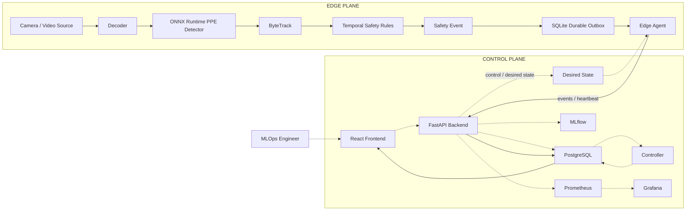
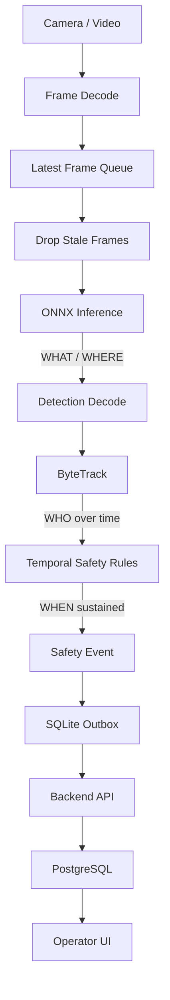
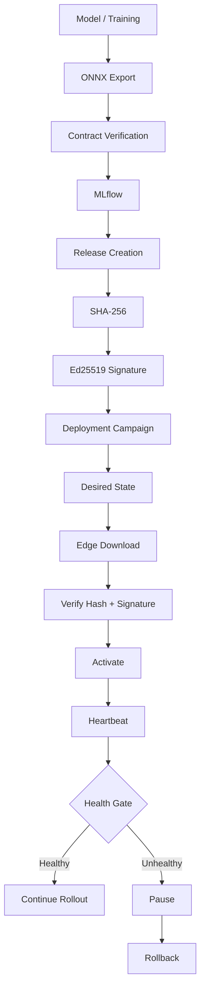
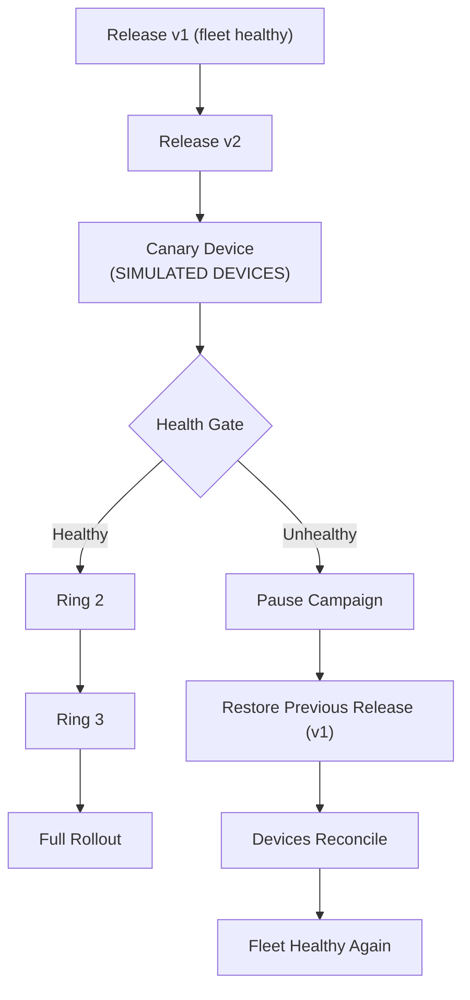
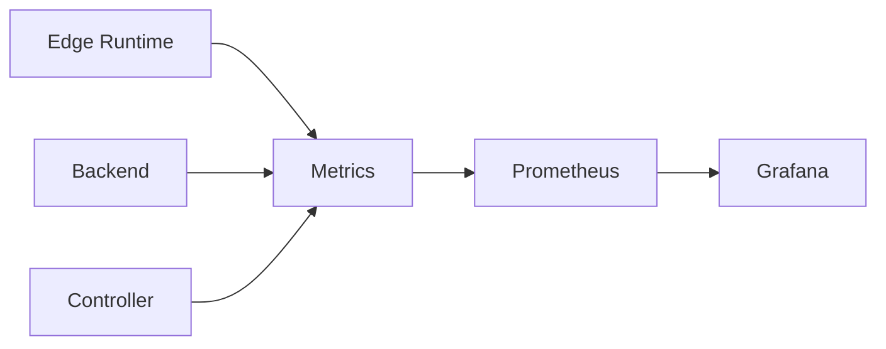
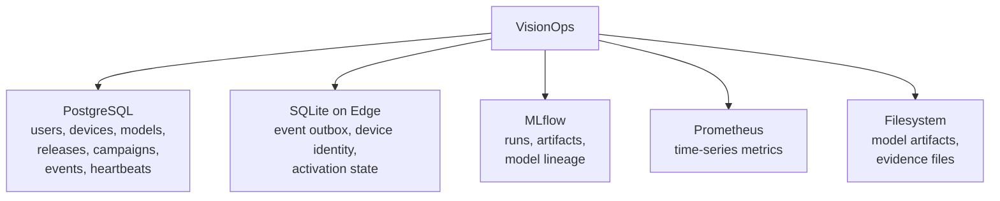
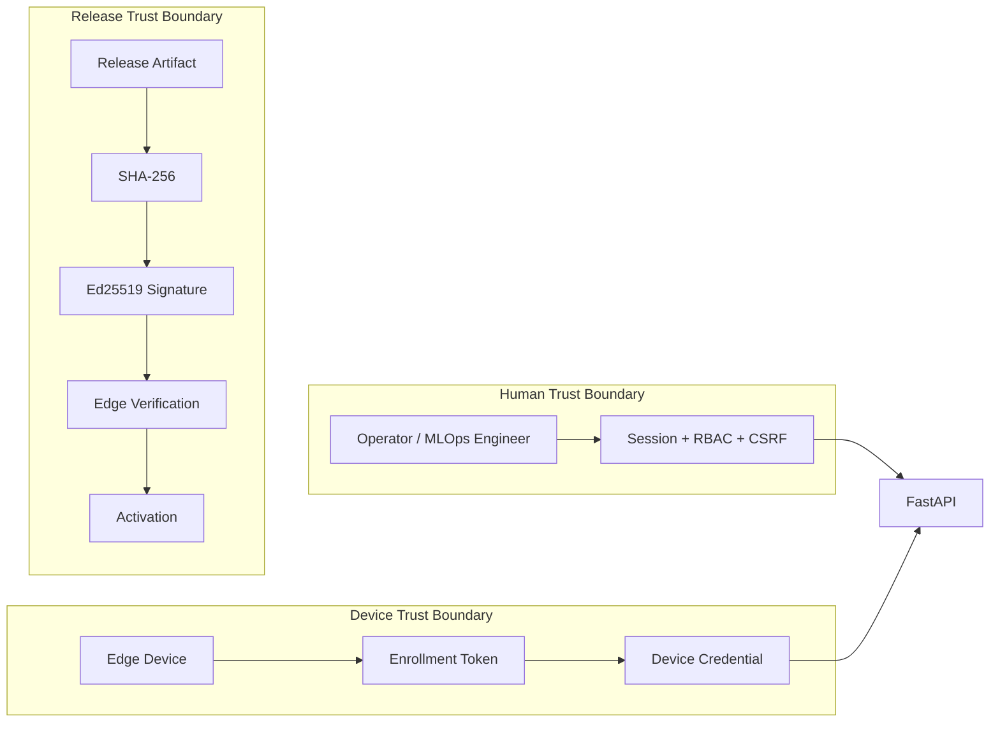
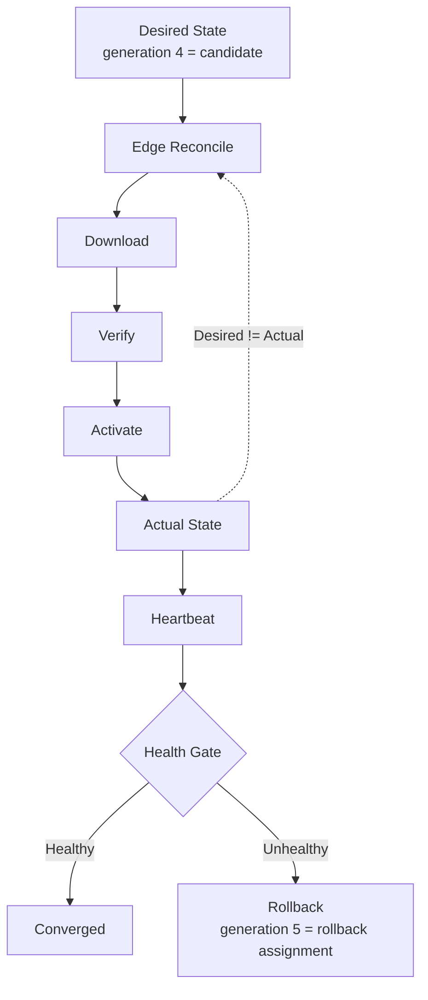
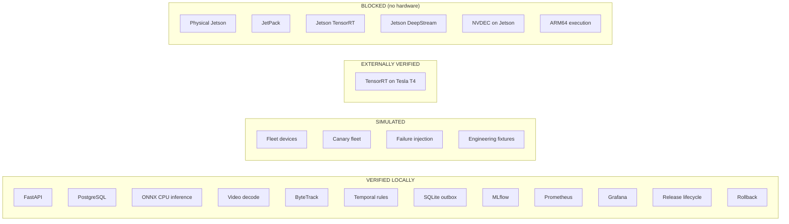
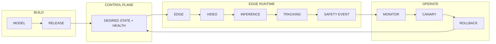

# VisionOps Mermaid Architecture Diagrams

Presentation-ready diagrams derived from
[VISIONOPS_SIMPLE_ARCHITECTURE.md](VISIONOPS_SIMPLE_ARCHITECTURE.md). Every diagram renders
independently in GitHub / Markdown. Nothing here is invented; components, flows and claims come
from that document.

## 1. Full System Architecture

The whole product in one picture: an operator console and control plane on the left, an
outbound-only edge device on the right, and the event path from camera to UI.

The edge has no inbound port: the agent connects out to FastAPI for desired state, artifact
download, heartbeats and safety events. Event visibility in the UI travels back through the
FastAPI query API.

## 2. Video Inference Pipeline

One frame from camera to database, with the question each stage answers.

- **WHAT / WHERE** — object detection: what is in the frame and where it is.
- **WHO over time** — tracking: the same person across frames, not a new person per frame.
- **WHEN sustained** — temporal rules: a condition that lasts long enough to be a real event.

Stale frames are dropped so processing stays near real time, and the event is written to the
local outbox before it is sent.

## 3. Model Lifecycle

From training to a health-gated rollout, including the point where the campaign branches.

A release pins the model, runtime and configuration by hash and is signed with a private key
the edge never holds. Devices reject anything whose bytes or signature do not match, so a model
cannot be activated unverified.

## 4. Canary + Rollback

The reliability story: a bad release is contained to one device and then withdrawn.

The canary is exactly one device, and expansion is gated on machine-readable health reason
codes rather than human judgement. The verified demo fleet is **simulated** — real agent
processes, real SQLite files, real HTTP and real application logic, but not physical hardware.

## 5. Observability

How health travels from the running system to a dashboard.

Metric examples (not an exhaustive list):

- device health and heartbeat age
- inference FPS and inference latency, dropped frames
- campaign state
- API latency and database availability

## 6. Storage Architecture

Each store exists for a different failure mode, not by accident.

PostgreSQL is the single source of central truth; SQLite keeps the edge durable when it is
offline with no central database at all; MLflow owns lineage; Prometheus owns time series; the
filesystem holds the bytes.

## 7. Security / Trust Boundaries

Three boundaries: a human, a device, and a signed artifact.

Credential types never mix: a browser session cookie cannot post heartbeats, and a device token
cannot call an operator endpoint.  A device only activates a release it has verified.

> [!CAUTION]
> **CURRENT DEVELOPMENT DEFECT:** Current locally-built Docker images must not be distributed
> until the `.dockerignore` / secret-baking issue documented in
> [VISIONOPS_ARCHITECTURE_AUDIT.md](VISIONOPS_ARCHITECTURE_AUDIT.md) is fixed and secrets are
> rotated. Do not push or distribute current images.

## 8. Deployment State Model

Desired state versus actual state, and how generations keep ordering safe.

While desired state and actual state differ, the device keeps reconciling. A rollback is simply
a *newer* assignment pointing at the *previous* release. Generation numbers are monotonic, so a
repeated or out-of-order message cannot move a device backwards. The numbers shown here are
illustrative examples, not runtime claims.

## 9. Real vs Simulated vs Blocked

What is actually verified on this machine, what is simulated, and what still needs hardware.

TensorRT on a Tesla T4 was verified on an external host and is **not** a Jetson result. Simulated
fleet devices are never physical edge devices. Model accuracy metrics remain unavailable until a
labeled evaluation dataset exists.

## 10. 60-Second Interview Diagram

The single picture to show when time is short.

Model becomes a signed release, the control plane decides where it runs, the edge turns video
into safety events, and monitoring drives canary rollout or rollback.

## Which Diagram Should I Use?

| Use Case | Diagram |
| --- | --- |
| Interview overview | 60-Second Interview Diagram |
| Technical architecture | Full System Architecture |
| Explain inference | Video Inference Pipeline |
| Explain MLOps | Model Lifecycle |
| Explain reliability | Canary + Rollback |
| Explain deployment control | Deployment State Model |
| Explain monitoring | Observability |
| Explain data ownership | Storage Architecture |
| Explain security | Security / Trust Boundaries |
| Explain honest scope | Real vs Simulated vs Blocked |
