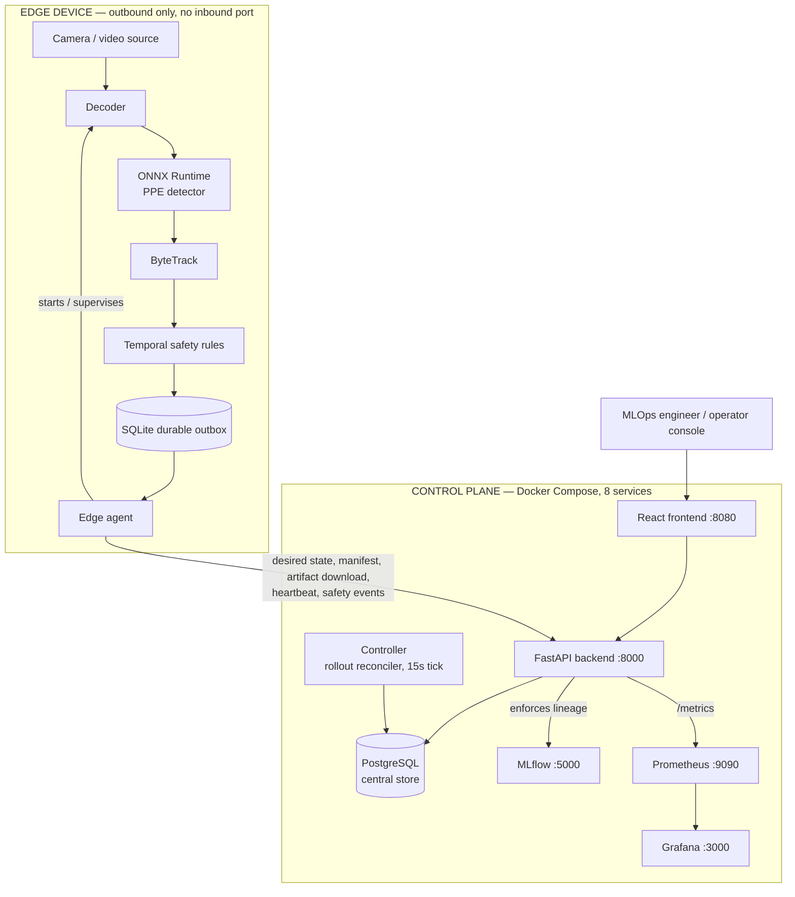
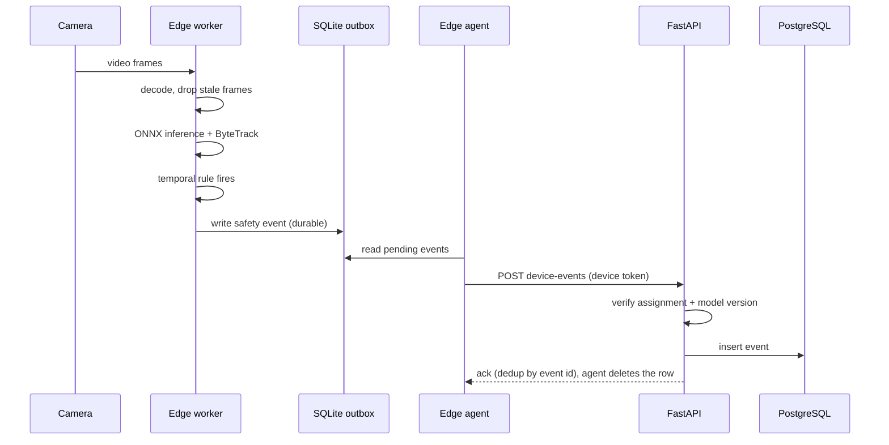
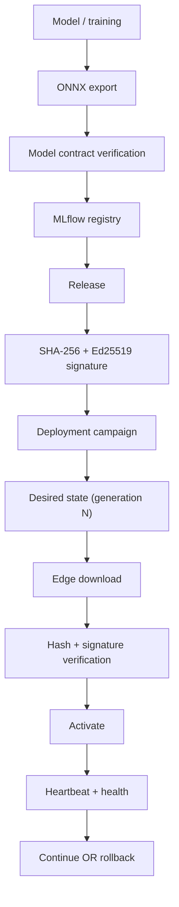
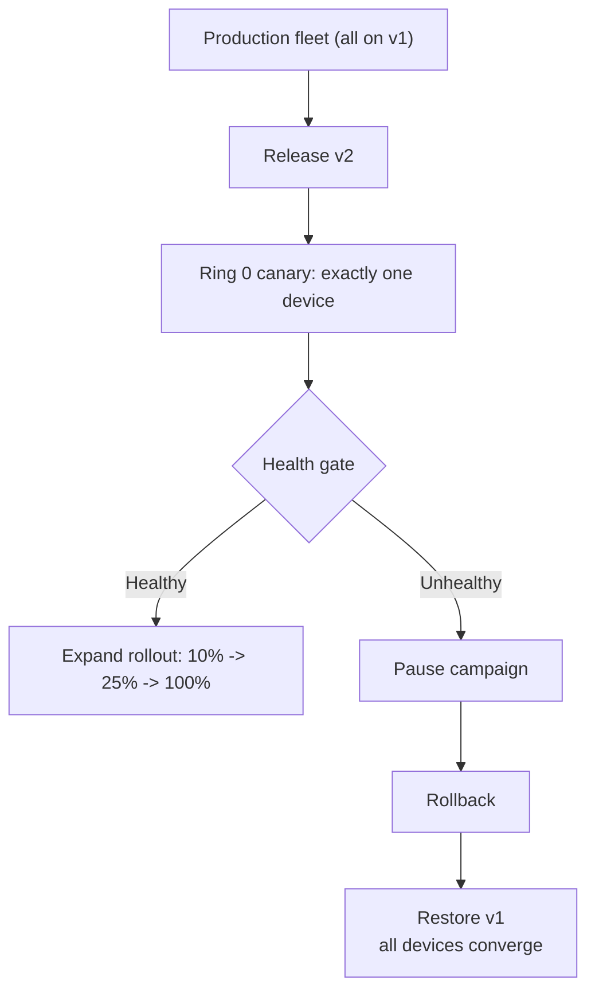

# VisionOps — Simple End-to-End Architecture

Understand the whole system in 5–10 minutes. Derived from the three documents below;
nothing here is invented.

| Want | Read |
| --- | --- |
| Understand the product fast | **this document** |
| Deep engineering reference (modules, routes, tables, metrics) | [VISIONOPS_END_TO_END_ARCHITECTURE.md](VISIONOPS_END_TO_END_ARCHITECTURE.md) |
| Known defects and remediation | [VISIONOPS_ARCHITECTURE_AUDIT.md](VISIONOPS_ARCHITECTURE_AUDIT.md) |
| How to run the demo | [VISIONOPS_INTERVIEW_DEMO_FLOW.md](VISIONOPS_INTERVIEW_DEMO_FLOW.md) |

## 1. What VisionOps Is

VisionOps is an edge computer-vision MLOps platform that runs PPE detection close to cameras,
sends safety events to a central control plane, and safely manages model deployment,
monitoring, canary rollout and rollback across edge devices.

In other words: **the operational layer around a computer-vision model** — everything that
makes the model runnable, observable and safely replaceable across many cameras.

## 2. The Big Picture



Two facts shape everything else:

1. **The edge is outbound-only.** No SSH, no push. Deployment is *desired state at a generation
   number*, so a device offline during a rollout converges when it reconnects.
2. **There is one canonical model contract** — the CPU adapter, the export gate and the
   generated NVIDIA parser read the same class mapping, so one model cannot be interpreted two
   ways in two runtimes. Training and lineage are in §6.

## 3. Control Plane

The control plane is the "central office". It owns all durable system state and manages:

| Manages | Meaning |
| --- | --- |
| Users | Operators with roles (RBAC) |
| Sites | Physical locations |
| Devices | Edge agents, identity and heartbeats |
| Cameras | Video sources attached to devices |
| Models, releases | Qualified artifacts and signed deployments |
| Deployments | Campaigns, rings, generations |
| Events | Safety events with provenance |
| Fleet health / monitoring | Heartbeat age, health state, metrics |

```text
React  ->  FastAPI  ->  PostgreSQL
```

- **FastAPI** is the only writer of central state; it serves operators and accepts device
  uploads. **PostgreSQL** is the single central store — deliberately no SQLite fallback.
- **Controller** is the rollout orchestrator: it issues download permits, evaluates health
  gates, pauses campaigns and finalises rollbacks. **MLflow** owns model lineage; the backend
  refuses a training run whose MLflow status disagrees rather than fabricating lineage.
- **Prometheus** scrapes the backend; **Grafana** renders dashboards.

## 4. Edge Plane

The edge runs next to the camera. It is deliberately dumb about policy and smart about
surviving bad networks.

```text
Camera -> decode frames -> ONNX inference -> PPE detections -> ByteTrack
       -> temporal rules -> safety event -> SQLite outbox -> central API
```

**Why SQLite exists.** Every event is written to a local durable outbox *before* it is sent: if the network disappears, events are not lost and are delivered when connectivity returns. This is also why a device only ever makes outbound connections — there is no inbound port to reach it.

## 5. One Video Frame Through the System

1. Camera produces video.
2. Edge decoder extracts frames.
3. Old frames are dropped to keep processing near real time.
4. ONNX model detects person / helmet / no-helmet.
5. ByteTrack associates detections across frames.
6. Deterministic temporal rules decide whether a sustained safety condition exists.
7. A safety event is created.
8. The event is written to the local SQLite outbox.
9. The edge agent sends the event to FastAPI.
10. FastAPI validates device / release / model provenance.
11. The event is stored in PostgreSQL.
12. The UI shows the event.
13. Prometheus and Grafana expose system health.



## 6. Model Lifecycle



- **Training → ONNX export** — the detector is trained (or a qualified open model adopted) and exported to a portable ONNX artifact.
- **Contract verification** — class mapping, input shape and output layout are checked against the canonical contract; a mismatch stops the pipeline before inference begins.
- **MLflow registry → release** — the artifact, contract and evaluation evidence are recorded as a run, then a release pins model, runtime, config and evaluation identity by hash.
- **SHA-256 + Ed25519 signature** — signed with a private key the edge never has; devices trust exactly one public key.
- **Campaign → desired state** — the release rolls out through rings; each device is told "your target is release R, config C, generation N".
- **Download → verify → activate** — pulled over an authenticated scoped connection; the device rejects anything whose bytes or signature differ, then stages the verified artifact into a slot and starts it.
- **Heartbeat + health → continue OR rollback** — the device reports what it actually applied, and the campaign expands or pauses.

## 7. Safe Deployment, Canary and Rollback



- **Desired vs actual state** — what the control plane says a device *should* run versus what the device reports it *is* running. Drift is visible.
- **Generations** — every assignment is monotonically numbered, so a repeated or out-of-order message cannot move a device backwards by accident.
- **Health gates** — the controller judges the candidate using machine-readable reason codes, never "looks fine to me".
- **Pause / local watchdog** — after repeated failed health ticks the campaign stops expanding, and a bundle that never reaches health is rolled back on the device without waiting for the control plane.
- **Rollback** — the control plane assigns the *previous* release and config at a *newer* generation, and only finalises when every device reports the previous release, previous config, `healthy` and a recent heartbeat. Otherwise the campaign ends `rollback_incomplete` rather than pretending success.

> **Demo honesty.** The verified demo fleet is **simulated** devices — real agent processes,
> real SQLite files, real HTTP, real application logic. The *deployment control logic* is
> production code; the *devices* are not physical hardware.

## 8. Observability

```text
Edge / Backend  ->  Metrics  ->  Prometheus  ->  Grafana
```

Observed: device health and heartbeat age, inference FPS and latency, dropped frames, campaign state, API latency, database availability.

Two rules the project keeps: **absent is not zero** (a never-measured metric is reported unknown, never healthy), and an unavailable accelerator is reported unavailable rather than silently falling back to CPU under a GPU label.

## 9. Storage

| Store | Holds |
| --- | --- |
| **PostgreSQL** | Central application state: users, devices, models, releases, campaigns, events, heartbeats |
| **SQLite** | Edge local state: event outbox, device identity, activation state |
| **MLflow** | Model experiments and model lineage |
| **Prometheus** | Time-series operational metrics |
| **Filesystem** | Model artifacts and evidence files |

**Why multiple stores?** Each is chosen for a different failure mode: PostgreSQL for central consistency, SQLite for edge durability *offline* (it must work with no central database at all), MLflow for lineage, Prometheus for time series, and the filesystem for the bytes.

## 10. Security

| Layer | Mechanism |
| --- | --- |
| Human | Session cookie + RBAC + CSRF protection (plus an Origin check) |
| Device | Enrollment token exchanged for a device credential |
| Release | SHA-256 + Ed25519 signature |
| Artifact | Hash verified before activation |
| Archive | Path traversal and symlink protection on extract |

Credential types never mix: a browser session cookie cannot post heartbeats, and a device token
cannot call an operator endpoint. Events are rejected unless the device has an assignment for
that release and config with a matching model version.

### ⚠️ Current development defect — Docker images contain secrets

The current locally-built images contain secrets and signing material because the repository has **no `.dockerignore`**, so `COPY . /app` copies `.env`, the operator credential and the **Ed25519 release-signing private key** into every image. This is a **current development defect, not part of the intended architecture**.

- **DO NOT PUSH OR DISTRIBUTE CURRENT IMAGES.**
- Remediation: [VISIONOPS_ARCHITECTURE_AUDIT.md](VISIONOPS_ARCHITECTURE_AUDIT.md) (finding **P0-2**). Reusing them locally for the demo is fine — they are content-current with the working tree.

## 11. Real vs Simulated vs Hardware-Blocked

| Group | Contents |
| --- | --- |
| **Real / verified locally** | FastAPI · PostgreSQL · frontend build + HTTP · MLflow · Prometheus · Grafana · ONNX CPU inference · video decoding · ByteTrack · temporal safety rules · SQLite durable outbox · event API · release signing · canary control flow · rollback / recovery |
| **Simulated** (mechanism real, data synthetic) | fleet / device population · canary device fleet · failure injection · engineering fixtures |
| **External GPU verified** | TensorRT on a Tesla T4 (`docs/evidence/tensorrt/final/`): FP32 parity 24/24 against the ONNX Runtime reference through the same canonical decoder |
| **Blocked** (needs hardware or data not present here) | physical Jetson · JetPack · Jetson TensorRT · Jetson DeepStream · NVDEC on Jetson · ARM64 execution · Jetson thermal / power telemetry · model accuracy metrics (mAP, `no_helmet` precision/recall) without a labeled evaluation dataset |

Nothing here is rounded up: simulated fleet devices are never called physical edge devices, and TensorRT on a T4 is never presented as a Jetson result.

## 12. Demo Story

1. Start the control plane. 2. Show healthy services. 3. Show the real PPE model and its pinned hash. 4. Run video inference. 5. Show tracking. 6. Show a deterministic safety-rule output. 7. Show the stored event. 8. Show Grafana. 9. Show release v1. 10. Start the v2 canary. 11. Inject a simulated failure. 12. The campaign pauses. 13. Roll back to v1. 14. The fleet converges healthy again.

Full commands, expected outputs and honesty notes: [VISIONOPS_INTERVIEW_DEMO_FLOW.md](VISIONOPS_INTERVIEW_DEMO_FLOW.md).

## 13. Why This Is MLOps

A CV model running on one laptop is not an edge production system. Production requires:

```text
MODEL + DEVICE + VIDEO + DEPLOYMENT + OBSERVABILITY + FAILURE RECOVERY + VERSION CONTROL
```

VisionOps exists to solve that operational layer. Different questions, different tools:

| Question | Answered by |
| --- | --- |
| **WHAT** is in the frame, and **WHERE**? | Object detection |
| **WHO** is it over time? | Tracking |
| **WHEN** has a condition lasted long enough to be a real safety event? | Temporal rules |
| **WHICH** model is deployed **WHERE**, is it healthy, and how is it safely replaced or rolled back? | MLOps |

## 14. Repository Map

```text
backend/         Central API and control plane
frontend/        Operator UI
edge/            Edge inference + deployment runtime
shared/          Contracts shared between control plane and edge
training/        Model training / evaluation logic
simulation/      Logical fleet / device simulation
observability/   Prometheus / Grafana
infrastructure/  Docker Compose, nginx, PostgreSQL
scripts/         Verification, release, export and operational commands
docs/            Architecture and evidence
```

## 15. 60-Second Interview Explanation

> VisionOps has two major parts: a central control plane and an edge runtime.
>
> The edge runtime receives video, performs ONNX PPE inference, tracks people with ByteTrack, applies deterministic temporal rules, and persists safety events locally before sending them to the backend.
>
> The control plane uses FastAPI and PostgreSQL to manage devices, releases, events and deployments. MLflow provides model lineage, while Prometheus and Grafana provide observability.
>
> For deployment, every release pins its model, runtime and configuration through hashes and is cryptographically signed. Devices pull desired state, verify the release, activate it, and report actual state and health.
>
> Deployment campaigns use canary rollout and health gates. If the candidate becomes unhealthy the campaign pauses, and devices can be rolled back to the last known-good release.
>
> On this machine we have verified the CPU ONNX pipeline and the MLOps control plane. We also have external TensorRT evidence from a Tesla T4. Physical Jetson execution remains explicitly unverified until we have real Jetson hardware.

Two caveats worth stating before you are asked, both from the audit: the **pause cause chain** is
not retained (phase-A / phase-B evidence missing), so failure→pause is classified **SIMULATED**
while rollback and recovery are **VERIFIED** (audit **P1-2**); and the retained release manifest
predates the current release-identity code, so bundle identity is **code-verified but not
evidence-verified** until a fresh release is created (audit **P1-7**). Evidence paths per claim:
[VISIONOPS_INTERVIEW_DEMO_FLOW.md](VISIONOPS_INTERVIEW_DEMO_FLOW.md).
