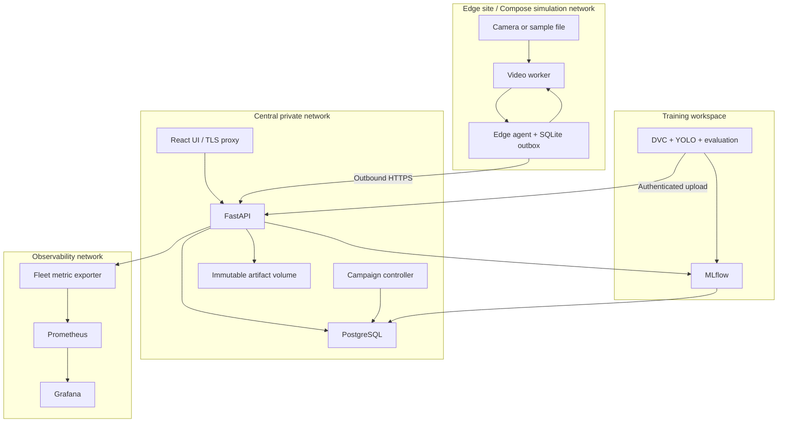
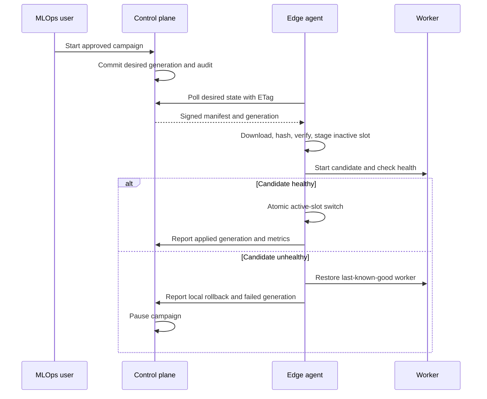

# 06 — Technical and visual design

## Five architecture boundaries

| Boundary | Responsibilities | Failure isolation |
| --- | --- | --- |
| Edge data plane | Decode, sample, infer, track, deterministic rule, local preview | Camera workers restart independently; WAN failure does not block inference |
| Central control plane | FastAPI, PostgreSQL, campaign controller, artifact gateway | DB is authoritative; no in-memory-only campaign state |
| Training / lifecycle | DVC, PyTorch/YOLO, evaluation, MLflow, export, signing | Training failures do not mutate deployed releases |
| Observability | Agent windows, Prometheus, Grafana, JSON logs | Exporters never block safety event processing |
| Security | Session/device identities, RBAC, TLS, signatures and audit | Untrusted payloads never become shell commands or unchecked file paths |

## Deployment topology


The exporter reads accepted heartbeat/MetricSummary records; diagram arrows denote data flow, not Prometheus scrape direction. Prometheus scrapes exporter/API endpoints on the private central network. Remote agents need no inbound WAN port. MLflow uses a separate PostgreSQL database/user and separate artifact prefix, never application tables.

## Video paths

CPU: FFmpeg demux/decode → bounded latest-frame queue → OpenCV resize/letterbox → ONNX Runtime CPU detector → ByteTrack → normalized detections → deterministic rule. PyTorch is the training/reference-evaluation path. A permitted ONNX PPE artifact is required for normal CPU inference.

NVIDIA: RTSP → GStreamer → NVDEC where supported → nvstreammux → TensorRT nvinfer → NvDCF tracking → adapter → the same deterministic rule. Verify YOLO output parser and class/preprocessing parity; exporting ONNX alone is not a working DeepStream integration. Use a small C++ DeepStream metadata bridge if the selected supported SDK does not provide a suitable maintained Python interface. Never write a decoder or tracker from scratch.

Camera defaults: sample input 1080p H.264 at source-native FPS, target inference sampling 5 FPS per camera, model input 640×640. Queue depth 2 frames per camera; drop oldest waiting frame, never allow queue growth. Drop frames older than 500 ms since decode completion. Camera acquisition latency is unknown unless source timestamps are reliable; report decode-to-event separately. RTSP TCP default, decode-progress timeout 10 seconds, reconnect exponential 1–30 seconds with jitter. One slow camera cannot stall a batch indefinitely: batch timeout 100 ms. These are policy targets subject to workload evaluation.

## Control and storage

One backend package, one API process and one controller process share SQLAlchemy/Alembic domain logic. Controller uses PostgreSQL advisory lock leader election and row locks/CAS generations; additional controllers remain standby. Loss of the dedicated advisory-lock database session stops assignments; no separate distributed lease service is implied. No Redis, Kafka or message broker. HTTP is at-least-once with idempotency; durable SQLite WAL outbox on edge and unique PostgreSQL event keys centrally.

Filesystem volumes: read-only versioned artifacts served by authorized API, separate evidence volume, media mount edge-local, writable SQLite/state/cache slots on edge. P0 files are local to the deployment machine; cloud object storage is P1. Writes use staging + fsync + atomic rename. DB record becomes ready only after file/hash validation; orphan cleanup is retryable. Back up PostgreSQL and artifact volumes together by recorded snapshot boundary.

## Update sequence



## Offline sequence

```mermaid
sequenceDiagram
  participant V as Video worker
  participant A as Edge agent
  participant C as Control plane
  V->>A: Safety event
  A->>A: Commit event to SQLite
  A-xC: Upload fails
  V->>V: Continue local inference
  C->>C: Approve rollback with newer generation
  A->>C: Reconnect and fetch newest desired state
  C-->>A: Latest approved generation
  A->>A: Reconcile; ignore obsolete target
  A->>C: Replay original event IDs
  C-->>A: Per-event acknowledgements
```

## UI and routes

Use restrained slate/navy, high-contrast text, amber warnings and red failures with text/icons; green only for fresh verified health. Persistent left navigation: Overview `/`, Events `/events`, Fleet `/devices`, Sites `/sites`, Models `/models`, Deployments `/deployments`, Drift `/drift`. Detail routes `/events/:safety_event_id`, `/devices/:device_id`, `/models/:model_id`, `/deployments/:deployment_campaign_id`; login `/login`. Forms open accessible dialogs with scrollable body and fixed action row; campaign creation uses a review step listing targets, previous release and health gates.

Overview shows separate actual video devices, active simulators, and seeded inventory; event feed, device freshness and active campaigns. Detail tables show desired versus actual versions, never a single ambiguous version badge. Models show lineage and evidence badges. Events show optional annotated snapshot, timestamps, class/confidence and review status. GPU unavailable is an explicit state, not a zero-value chart. Desktop 1280px is primary; at 768px navigation collapses and tables scroll. Keyboard focus, labeled controls, dialog escape and status text are required.

Live annotated video is edge-local (loopback preview); central P0 only displays event snapshots. No central live-video proxy or exposed edge HTTP endpoint. The demo can show the preview and dashboard side by side.

## Tradeoffs

Polling simplifies NAT and reconnect at the cost of up to one poll interval for convergence. Single-node PostgreSQL/volumes keep the project runnable but are not high availability. Slot switching can briefly interrupt inference; record the gap rather than claim zero downtime. Separate CPU/GPU profiles cost evaluation work but avoid false portability claims. No autonomous release promotion: explicit human gates keep a small fleet demo understandable.
