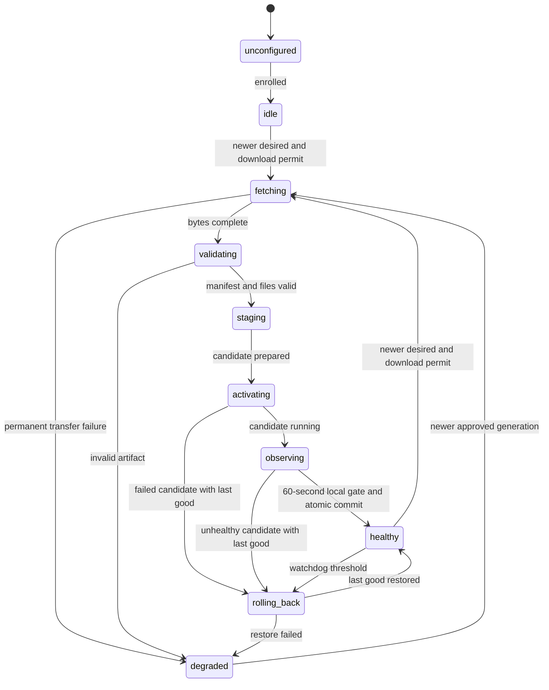

# 11 — Edge Agent contract

The Edge Agent is a deterministic supervisor, not an LLM agent. It controls a fixed inference worker and approved artifacts; it has no arbitrary remote execution API. Identity, fields and endpoints are fixed by [09_DOMAIN_MODEL.md](09_DOMAIN_MODEL.md) and [10_API_CONTRACTS.md](10_API_CONTRACTS.md).

## Responsibilities and scheduling

| Responsibility | Contract |
| --- | --- |
| Identity | One device_id/site_id, mode and credential per persistent agent state directory; do not clone credentials when scaling containers |
| Heartbeat | 15 seconds ±20% jitter, boot UUID and persisted sequence per boot; current actual state, source health, version IDs and windows |
| Desired polling | 15 seconds ±20% jitter using ETag; fetch immediately after reconnection and before activation |
| Network | Outbound TLS, certificate verification, 5-second connect/15-second request timeout; exponential full-jitter backoff 1–60 seconds; honor 429 Retry-After |
| Worker health | Local IPC liveness every 5 seconds; missing response 15 seconds triggers failure. Frame progress separate from process liveness |
| Artifact transfer | Stream to .part, range resume only if ETag unchanged; size cap 2 GiB per artifact, hash entire completed bytes; require disk space for both slots plus 20% margin |
| Validation | Manifest signature/public key, sha256, target profile, engine/runtime compatibility, class map/input shape and monotonic generation; any failure preserves active slot |
| Activation | Fixed worker entrypoint, staged inactive slot, record intent then launch warmup; commit atomically only after 60-second healthy candidate window with actual inference progress |
| Local rollback | Candidate fail or 3 worker crashes in 5 minutes restores last known-good release/config; report failed generation; quarantine it until newer desired generation |
| Watchdog | Exponential process restart 1–30 seconds, at most 3 in 5 minutes; after failed rollback enter degraded and require new approved state |
| Telemetry | Nonblocking windows and JSON logs; optional exporters must never block worker or SQLite commit |

For simulation, the same supervisor state machine and real artifact hash/signature/file operations run, but the worker is a deterministic simulator with explicit simulated metrics. It is not hardware verification. Actual video workers must produce real frame/detection/latency observations.

## State transitions

Network disconnection is an orthogonal condition, not a replacement for worker state. `degraded` may still serve last-known-good inference. Bootstrap with no last-good bundle cannot roll back; keep degraded and report empty actual state. Local candidate observation is not the central 5-minute campaign gate.

## Durable local record and crash recovery

SQLite WAL stores desired generation seen, applied generation, active slot, previous good slot, candidate generation, rejected generations, boot IDs, event outbox and upload receipts. Each filesystem swap is paired with an activation journal. On startup reconcile journal to verified slot pointers: incomplete candidate is discarded or rechecked; never advance applied_generation because download finished. Preserve last good artifact until central rollback references expire and a later successful release exists.

Before atomic activation refetch desired state when connected. If a newer generation appears, discard obsolete candidate and reconcile newest. If connectivity disappears during staging, keep last good and postpone activation until newest desired state can be checked; already active inference continues. After the atomic switch, persist actual release/config and applied_generation together. Heartbeats carry committed state only. Local rollback does not invent a central generation: actual_release_id reverts, applied_generation remains the last successfully committed central generation, and rejected_generation identifies the rejected desired generation and last_error_code records a bounded reason; server detects the mismatch and pauses campaign.

## Outbox and freshness policy

Two data paths have different loss policies. Video queues are memory-only, depth 2 per camera, drop oldest waiting frames and decode-aged frames >500 ms. Safety metadata is committed durably before network send. Local outbox cap: 10,000 safety records OR 100 MiB metadata, whichever first; snapshot cache 200 MiB/7 days, sampled detections 1,000 records/10 MiB. Safety records retained up to 7 days offline; once cap/TTL reached, evict oldest unacknowledged safety metadata only as last resort and increment durable loss counter. This is bounded best effort, not lossless under indefinite outage. UI reports data loss.

Safety metadata priority > snapshots > sampled detections. Snapshot eviction never deletes a metadata event. Metrics coalesce to latest per-camera window and are not backfilled indefinitely. Send ≤100 event records/1 MiB per batch. Delete only per-ID accepted/duplicate acknowledgements; permanent rejections enter bounded dead-letter state and report reason; transient failures retry. Same ID with differing payload is rejected centrally as integrity conflict. Snapshot retries use event identity and byte hash.

## Config and process boundary

Agent runs unprivileged and does not mount Docker socket. Docker packages the agent/runtime environment; worker bundles are versioned application files staged into two slots within a compatible base image. Bundles cannot install system dependencies or change agent/OS. New system dependency requires a separately provisioned base environment and compatibility profile; do not pretend P0 updates replace drivers or the container engine.

The worker talks to the agent over a local Unix socket with versioned normalized detection and health messages. Header: schema_version=1, device_id, camera_id, stream_session_id, frame_sequence, observed_at; payload: detections or metrics. Validate length ≤1 MiB and frame monotonicity; no pickle or executable serialization. Local preview binds loopback only; not exposed through central API.

## Recovery demonstrations

Interrupt WAN, restart agent during download, corrupt artifact, crash candidate and reconnect after central rollback. Evidence must include SQLite restart persistence, last-good preview continuity where possible, rejected generation, central pause, deduplicated events and eventual actual/desired convergence. Use document 17 acceptance criteria rather than conventional test frameworks.

## Bootstrap, candidate output and update precedence

On first commissioning with no cameras, execute the runtime-bundled signed warmup fixture for the 60-second process/model check. Do not emit synthetic DetectionEvents/SafetyEvents or count fixture inference as production telemetry. This establishes worker readiness only; source health remains unknown and the device cannot join a real campaign until a configured source supplies a full baseline. A stopped/file-ended source is not a crash; its absence blocks campaign inference-health gates but should not cause a restart loop.

P0 activation uses a brief stop/start in the compatible runtime (no assumption of enough memory for concurrent GPU models). Commit intent before stopping old worker. Candidate camera output is local during its 60-second health window; suppress central safety/detection publication until commit, then start a new stream_session_id and temporal rule. Record the observation/event gap explicitly; do not claim uninterrupted detection during updates. Rollback restores prior bytes, revalidates health for 60 seconds and reports committed state. WAN-only outages without update still preserve inference. Critical failures during local observation stop the candidate and restart last good immediately; the prior worker can resume inference before its recovery report completes.

With a candidate already stopped/observing when WAN disappears, restore last good and report pending reconciliation on reconnect rather than run an uncommitted candidate indefinitely. Check newest desired before starting candidate and again before committing. If newer desired arrives, discard candidate and restore active baseline before reconciling. Config-only source changes skip model/runtime fetch, validate the permitted override, apply sources and atomically report generation; they do not fake healthy inference for disabled sources. Retain rejected_generation explicitly in heartbeat.

Device mode real/simulated remains server-bound. Simulator faults are scoped to the candidate release/generation so the previous baseline can recover during rollback. The simulator state follows the same download, 60-second local gate, 5-minute central observation and durable receipt logic; no accelerated-clock results are shown as live production health.
