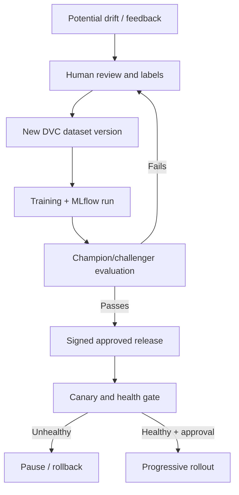

# 14 — Drift and retraining specification

## Distinctions

Data drift: input distribution changes, such as lighting, camera angle or head size. Concept drift: the relationship between visual evidence and the target label changes, such as new PPE designs or a revised safety definition. Performance degradation: measured labeled precision/recall falls. Confidence change alone proves neither concept drift nor reduced accuracy.

## P0 signal algorithm

Use per-camera/model-version class proportions and fixed 10-bin confidence histograms over 24 hours. Compare with a reference histogram collected from the approved baseline validation/representative deployment window and linked to reference_dataset_version_id. Require ≥500 relevant detections for both baseline and current window. Apply additive 1e-6 smoothing and Jensen–Shannon divergence using base-2 logs, range [0,1]. Flag potential drift when JS >0.10 in two consecutive daily eligible windows; the first exceedance is logged but does not request retraining. Threshold is a proposed screening policy, not demonstrated statistical calibration. Sparse windows create insufficient_data with score=null.

P0 also records event rate per camera-hour and low-confidence fraction to support review; no automatic alert from these alone. Camera health failure, known source/config change and simulated data must be separated from real drift. Reset/reference-review after an approved camera relocation or release change; do not compare incompatible class maps. P1 may add brightness/blur/embedding distributions and labeled performance monitoring, after data permissions and value are established.

## Hard-example collection and review

Capture optional event snapshots and bounded additional samples from uncertain/occluded scenes. A local CV CLI selects up to 20 examples per camera/day and 200 MiB total cache, writes actual JPEG evidence and registers HardExample. Sampling is not evidence of accuracy. Use capture reason and camera/time grouping to avoid hundreds of near-identical frames. No automatic raw-video cloud upload.

Reviewer sees real snapshot, source camera, generating release, confidence and capture reason. Labels follow class IDs 0/1/2 and normalized boxes; ambiguous/unobservable heads are marked unlabelable in review and excluded from positive/negative PPE scoring. Accepted records require a human-reviewed annotation; rejected records keep reason until 7-day expiry. The API persists accepted/rejected status and reviewer. Label export CLI marks accepted examples exported only after a successful DVC snapshot. P0 supports JSON label import and review of overlays; a full drawing/annotation application is not required.

## Trigger and lifecycle

CV/MLOps explicitly accepts the signal, chooses accepted examples, records rationale and creates RetrainingRequest. A CLI worker run is manually started; no hidden automatic training scheduler. Request transitions requested→running when TrainingRun linked, then completed/failed; cancellation before training is permitted. Completion means run finished, not promotion. All new datasets use a new DVC hash and Git commit; do not overwrite a prior training dataset.

## Champion versus challenger

Champion is the last approved production reference for that hardware profile; resolve its immutable release/model IDs at evaluation start, never rely on mutable MLflow alias later. Challenger uses the unchanged held-out evaluation split plus a separately reported new-domain slice. Apply document 13 absolute metrics, accuracy-regression and hardware budgets. Better aggregate mAP cannot hide worse no_helmet recall on an important slice. If evidence is insufficient, result BLOCKED. Store metrics, support and model/dataset references side by side.

## Promotion controls

Only MLOps can approve a release after evaluation and signature. Every retrained release goes through the same campaign path; there is no bypass for retraining. No drift job can write desired state. After rollback, keep failed candidate evidence and review cause before retraining again. Production deployment extensions may automate training job execution, but never equate successful training with release approval.

## Failure behavior

Missing evidence: show unavailable; do not label a substitute image. DVC remote unavailable: retain local labels and retry export without changing dataset version. MLflow unavailable: preserve local run evidence and register only after reconciliation. Schema/taxonomy mismatch: block dataset validation. Drift job rerun uses stable window/camera/model identity for deduplication. API/list states follow FRD and every decision is audited.
